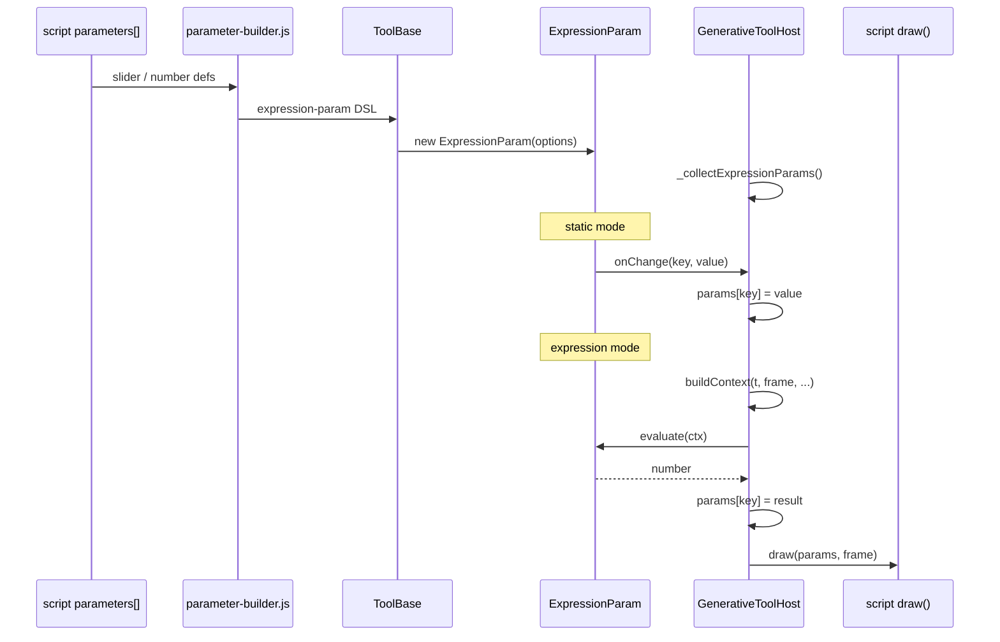

# ExpressionParam

Numeric generator parameter with static (`=`) / expression (`f`) mode toggle. Replaces the prior slider + `ModulatorChip` row pattern on generator PARAMS tabs.

## Names

| Layer | Identifier |
| --- | --- |
| Class | `ExpressionParam` |
| ComponentLibrary | `ComponentLibrary.ExpressionParam` |
| ToolBase DSL | `'expression-param'` |
| DOM root class | `expression-param component` |
| Owner file | `assets/js/shared/components/input/ExpressionParam.js` |

## Layout

```
LABEL                    ← hover: param.description tooltip
[=] [slider + field]     ← static mode
[f] [expression text]    ← expression mode
     ↑ hover: EXPRESSION_CONTEXT_SCHEMA reference
```

- Toggle: `F × 2` square; shows `=` (static) or `f` (expression); accent border on active mode.
- Static mode: composes `NumericInput` (`display: 'both'` for sliders, `'field'` for number params).
- Expression mode: single-line text field; compiled and evaluated per frame by host.

## ToolBase DSL

```javascript
['expression-param', label, min, max, step, {
  key:         'meshRotation',
  value:       0,
  precision:   3,
  description: 'Toroidal mesh rotation angle in radians.',
  display:     'both',   // 'both' | 'field' | 'slider'
}]
```

Emitted by `parameter-builder.js` for script `parameters[]` entries of type `slider` or `number`.

## Options

| Option | Type | Default | Description |
| --- | --- | --- | --- |
| `key` | string | required | Script param key; stored as `paramKey` |
| `label` | string | `''` | Row label (rendered UPPERCASE) |
| `description` | string | `''` | Label hover tooltip |
| `min` | number | `0` | Static slider/field minimum |
| `max` | number | `100` | Static slider/field maximum |
| `step` | number | `1` | Static increment |
| `value` | number | `min` | Initial static value |
| `precision` | number | `0` | Decimal places for static field |
| `display` | string | `'both'` | Passed to `NumericInput` |
| `onChange` | fn | noop | Static value change → host writes `params[key]` |
| `onExpressionChange` | fn | noop | Mode toggle or expression edit → host redraw |

## Public API

| Method / property | Returns | Purpose |
| --- | --- | --- |
| `paramKey` | string | Script param key |
| `getMode()` | `'static'` \| `'expression'` | Current input mode |
| `isExpressionMode()` | boolean | Host frame-loop gate |
| `getValue()` | number | Static value or last evaluated result |
| `getExpression()` | string | Raw expression text |
| `evaluate(ctx)` | number | Run compiled expression against `buildContext()` output |
| `setValue(val, triggerChange?)` | void | Preset/reset; updates static slider only |

Expression mode does **not** emit `onChange` per frame. Host calls `evaluate(ctx)` inside `draw()`.

## Data flow



### Host integration (`generative-tool-host.js`)

1. After `tool.mount()` → `_collectExpressionParams()` scans `tool.componentInstances` for `componentType === 'expression-param'`.
2. Start of every `draw()` → `_evaluateExpressions()`:
   - Builds context via `buildContext({ t, frame, fps, loop, params, ... })`.
   - For each component where `isExpressionMode()` → `params[ep.paramKey] = ep.evaluate(ctx)`.
3. `handleUpdate`: keys ending `__expr` → `draw()` (expression text or mode change).
4. `updatePhaseAnimations()` retained as deprecated alias → `_evaluateExpressions()`.

### Direct ComponentLibrary use

```javascript
const ep = new ComponentLibrary.ExpressionParam({
  key: 'meshRotation',
  label: 'Mesh Rotation',
  min: 0, max: 6.28, step: 0.001, value: 0,
  description: 'Toroidal mesh rotation angle in radians.',
  onChange: (v) => { /* static */ },
  onExpressionChange: () => { /* redraw */ },
}, deps);
container.appendChild(ep.render());
```

## Code reuse

### Reused (current)

| Concern | Source |
| --- | --- |
| OO lifecycle | `BaseComponent` — `createElement`, `addChild`, `destroy`, `getF()` |
| Static input | `NumericInput` child |
| Expression variables | `expression-context.js` — `EXPRESSION_CONTEXT_SCHEMA`, `buildContext()` |
| Sidebar wiring | ToolBase `_parseComponentOptions` + `parameter-builder.js` |
| Registration | `component-library.js` |

**Approx reuse:** ~40% of behaviour delegates to existing code; ~372 lines in owner file (UI, compile, tooltip).

### Not reused (gaps)

| Concern | Duplicate / skip | Also exists in |
| --- | --- | --- |
| Expression compile | `_compileExpression()` in component | `driver-registry.js` `DRIVER_EXPRESSION.init` |
| Expression text field | raw `<input>` + inline styles | `TextInput` |
| Mode toggle | raw `<button>` + inline styles | `Button`, `ModulatorChip` |
| Tooltips | module singleton + `document.createElement` | no shared `Tooltip` component |
| Label row | hand-built `<span>` | `NumericInput` label row |

### Ideal modular split (refactor target)

```
expression-compile.js   ← single compile owner (generators/core or algorithms)
Tooltip.js              ← shared hover popover (ComponentLibrary)
ExpressionParam.js      ← layout + mode state (~150 lines)
  ├── NumericInput      (static)
  ├── TextInput         (expression)
  └── Button / ToggleGroup (= / f)
```

**Target reuse:** 70–80% UI from library; compile/eval in one shared module.

## File ownership

| Concern | Rule owner | Current owner | Compliant |
| --- | --- | --- | --- |
| UI component | shared / ComponentLibrary | `ExpressionParam.js` | yes |
| Sidebar DSL | `parameter-builder.js` | `parameter-builder.js` | yes |
| Expression context | `expression-context.js` | `expression-context.js` | yes |
| Frame orchestration | `generative-tool-host.js` | `generative-tool-host.js` | yes |
| Expression compile | single module | duplicated | no |
| CSS | `tools.css` / `components.css` | inline in component | no |
| Animation loop | `animation-foundation.js` | unchanged (`AnimationLoop`) | yes |

## OOP / architecture compliance

### Pass

- Extends `BaseComponent`.
- DOM via `this.createElement()` inside component (except tooltip singleton).
- Registered in `ComponentLibrary`; consumed via ToolBase DSL.
- Tool/section files do not build this UI directly.
- `NumericInput` child via `addChild()` for destroy cascade.
- Host calls `evaluate(ctx)` only; no UI in host.
- Colours: `var(--c-*)` only. Sizing: F-system via `getF()` / `F2`.

### Violations / smells

| Issue | Severity | Detail |
| --- | --- | --- |
| Cross-layer import | medium | `ExpressionParam` (shared) imports `tools/generators/core/expression-context.js`. Same direction as `ModulatorPanel` → `driver-registry.js`. |
| Raw DOM for tooltip | low–medium | Module-scope `document.createElement`; not `BaseComponent.createElement`. |
| Inline styles | medium | No `.expression-param` rules in CSS modules. Matches `NumericInput` / `ModulatorChip` precedent. |
| `innerHTML = ''` in `_showActiveInput` | medium | Clears slot; re-appends `NumericInput.element`. Detach without destroy; re-render risk. |
| Dead modulator stack | low | `ModulatorChip`, `ModulatorPanel`, `modulation-engine.js` still registered; unused on PARAMS tab. |
| State not serialised | medium | Expression mode + text not in presets / sequencer / export. `setValue()` static only. |
| `_collectExpressionParams()` once | medium | Only after initial mount; sidebar rebuild may stale registry. |
| `__expr` hack key | low | ToolBase emits `{key}__expr`; host special-cases suffix. |
| `updatePhaseAnimations` alias | low | Deprecated; verify no caller expects modulator semantics. |

## Style guide adherence

Reference: `blog/docs/guides/standards/text-treatment.md`, `design-law.md`.

| Rule | Status | Notes |
| --- | --- | --- |
| Atkinson Hyperlegible / Mono | pass | label, toggle, expression field |
| Label UPPERCASE, `F × 0.75` | pass | sidebar parameter label spec |
| Row height `F × 2` | pass | toggle, expression input |
| Input as-typed, `F × 0.75` | pass | expression field |
| `var(--c-*)` only | pass | |
| No radius / shadow | pass | |
| F-based dimensions | pass | |
| Border system adjacency | partial | toggle full box; may double-border vs NumericInput |
| ComponentLibrary mandate | partial | uses `NumericInput`; skips `TextInput`, `Button` |
| CSS module routing | fail | all inline |
| `debugLog` not `console.log` | pass | no logging added |

**Vs peers:** consistent with `ModulatorChip` / `NumericInput`. Not aligned with long-term modular CSS goal.

## Dead / orphaned code (post-migration)

Still present; not used by generator PARAMS tab:

- `assets/js/shared/components/input/ModulatorChip.js`
- `assets/js/shared/components/input/ModulatorPanel.js`
- `assets/js/tools/generators/core/modulation-engine.js`
- `assets/js/tools/generators/core/driver-registry.js` (expression driver duplicate)
- ToolBase: `'modulator-chip'`, `'modulator-panel'`
- `PaletteRow`: `hasModulator` / `modEnabled` props no longer passed from `parameter-builder.js`

Script `animation.modulators[]` declarations are **ignored** by host after migration.

## Known functional gaps

1. **Presets / reset** — expression mode and text not restored; numeric `setValue` only.
2. **Export / sequencer** — expression state absent from checkpoint save/load.
3. **`cycleFrames` param** — does not update runtime `loop`; host reads `scriptConfig.animation.loopFrames`.
4. **Expression mode** — no live evaluated readout while paused (slider hidden by design).
5. **Eval order** — `params.*` in expressions uses snapshot; order = `componentInstances` order, not script param order.
6. **Toggle tooltip** — plain text; fixed position; no viewport flip.

## Review checklist (follow-up agent)

**Architecture**

- [ ] Extract `compileExpression(src)` to single owner; delete duplicates
- [ ] Facade for `EXPRESSION_CONTEXT_SCHEMA` (remove shared→tools import)
- [ ] Remove or deprecate modulator stack
- [ ] Re-call `_collectExpressionParams()` after sidebar rebuild

**OOP / components**

- [ ] Expression field → `TextInput` (empty label)
- [ ] Toggle → `Button` or `ToggleGroup` (`=`, `f`)
- [ ] Extract shared `Tooltip`

**CSS**

- [ ] `.expression-param*` → `tools.css`
- [ ] Reduce inline `style.cssText`

**State / UX**

- [ ] Serialise `{ mode, expression, staticValue }` in presets and sequencer
- [ ] Wire runtime loop length from `cycleFrames` where applicable

**Compliance**

- [ ] Page audit: `#tools/generators?script=torus`
- [ ] Border-system: toggle adjacent to NumericInput

## Summary ratings

| Aspect | Rating | Notes |
| --- | --- | --- |
| Reuse | fair (~40%) | good `NumericInput` + `buildContext`; poor compile / TextInput / Button |
| Ideal modularity gap | ~60% | ~150 lines composition + one compile module sufficient |
| Style vs rules | fair | matches peer inputs; CSS routing weak |
| OOP / ownership | good | proper split; cross-layer import main debt |
| Migration completeness | partial | new path works; modulator stack orphaned |
| Production readiness | MVP | missing preset persistence and loopFrames wiring |

## Related

- `input/NumericInput.md` — static mode child
- `input/TextInput.md` — not yet used for expression field
- `assets/js/tools/generators/core/expression-context.js` — sandbox vars + `buildContext()`
- `assets/js/tools/generators/core/parameter-builder.js` — DSL emission
- `assets/js/tools/generators/core/generative-tool-host.js` — evaluation orchestration

## Example: torus rotation (manual)

Toggle `f` on rotation params; enter:

```
meshRotation:  frame * TAU / loop
spiralAngle:   -frame * TAU / loop
xRotation:     frame * TAU / loop
```

Params load static by default; user switches mode manually.
