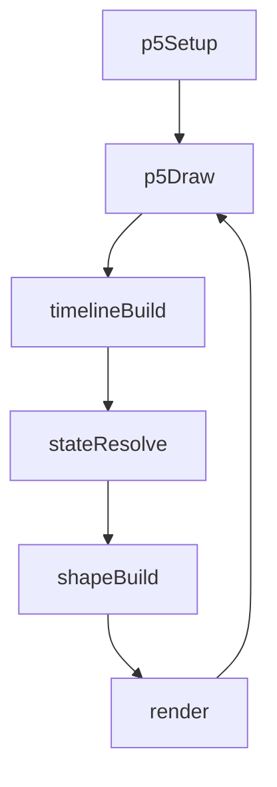
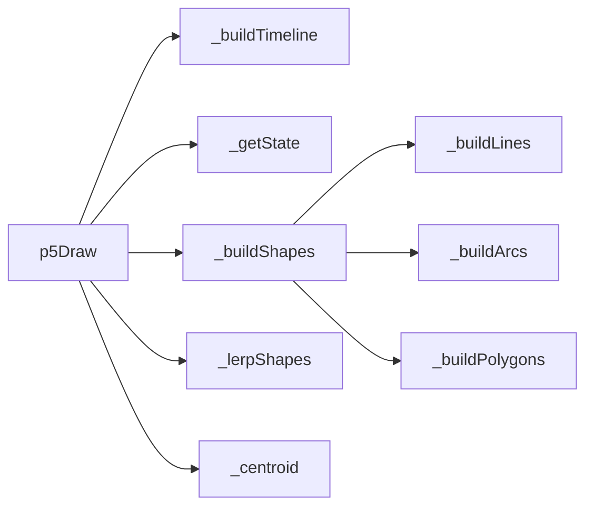
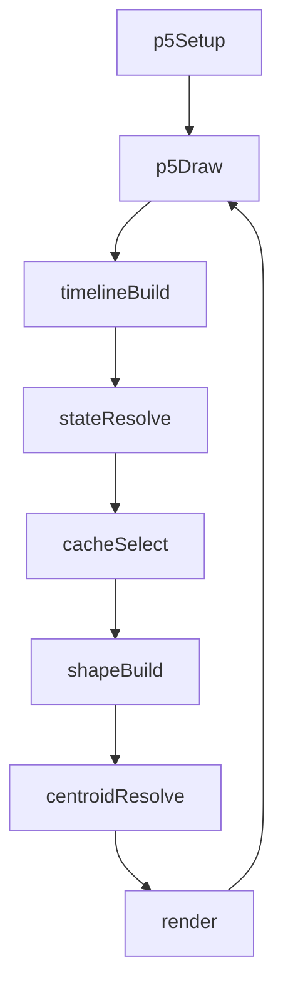

# animated-lines — System Map

## Reference (v4 — 2026-04-23)

**Source:** `reference/generators/animated-lines/source/animated-lines.gen.js` (300 lines)  
**Mode:** p5 geometric morph  
**Coverage:** 6 units mapped, 0 not-relevant

### Lifecycle

### Function Call Graph

### Data Pathways

| pathway_id | input | transform chain | output | per-frame? | parallelisable? |
|---|---|---|---|---|---|
| P-01 | timing params + frame | timeline + eased segment state | `state` object | yes | no |
| P-02 | shape params + state | line/arc/poly construction | shape point arrays | yes | yes (per-line/per-point) |
| P-03 | shape arrays + centroid + rotation | centring + transform + draw | rendered nested forms | yes | no |

### State Inventory

| name | scope | type | purpose | initialised by | mutated by |
|---|---|---|---|---|---|
| _timeline | SCRIPT_CONFIG | Array<object> | animation segment plan | _buildTimeline | _buildTimeline |
| _totalDuration | SCRIPT_CONFIG | number | loop duration in ms | _buildTimeline | _buildTimeline |
| _timelineKey | SCRIPT_CONFIG | string | timeline invalidation key | _buildTimeline | _buildTimeline |

## Live (v4 — 2026-04-23)

**Source:** `assets/js/tools/generators/scripts/pattern/animated-lines.gen.js` (398 lines)  
**Mode:** p5 geometric morph + caches  
**Coverage:** 8 units mapped, 0 not-relevant

### Lifecycle

### Function Call Graph

### Data Pathways

| pathway_id | input | transform chain | output | per-frame? | parallelisable? |
|---|---|---|---|---|---|
| P-01 | timing params + frame | timeline + eased segment state | `state` object | yes | no |
| P-02 | shape params + state + cache keys | cached/rebuilt geometry arrays | shape point arrays | yes | partial |
| P-03 | shape arrays + centroid cache + rotation | centring + transform + draw | rendered nested forms | yes | no |

### State Inventory

| name | scope | type | purpose | initialised by | mutated by |
|---|---|---|---|---|---|
| _timeline/_totalDuration/_timelineKey | SCRIPT_CONFIG | mixed | timeline plan and invalidation | _buildTimeline | _buildTimeline |
| _shapes*, _shapes*Key | SCRIPT_CONFIG | mixed | geometry cache sets | p5Draw | p5Draw |
| _centroid_val/_centroidKey | SCRIPT_CONFIG | mixed | centroid cache | p5Draw | p5Draw |

## Architectural Divergence Notes

- Live adds geometry and centroid cache layers to avoid redundant rebuild during hold segments.
- Live renames timing control from `fps` to `speed` with multiplier semantics.
- Live adds export metadata and expanded info sections while keeping core morphology and timeline logic parity.
