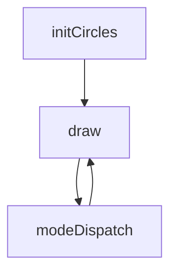
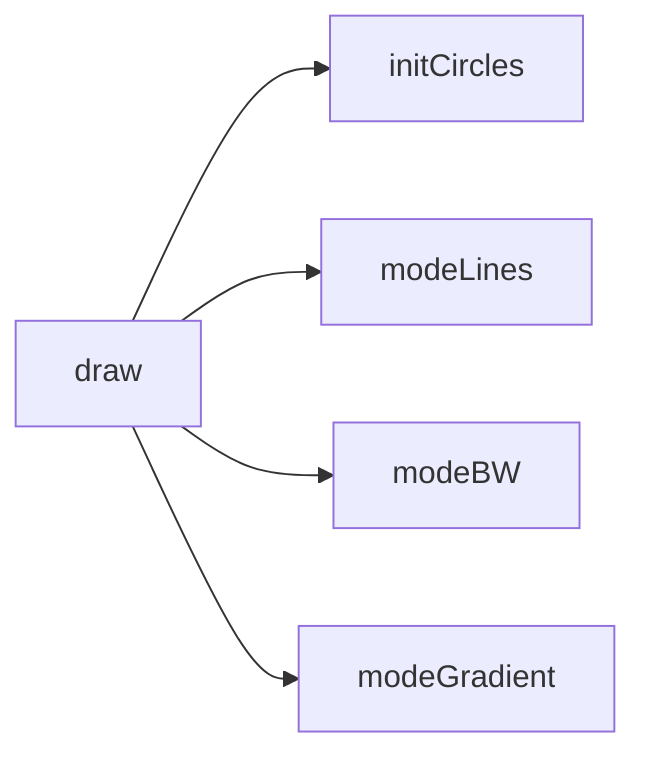
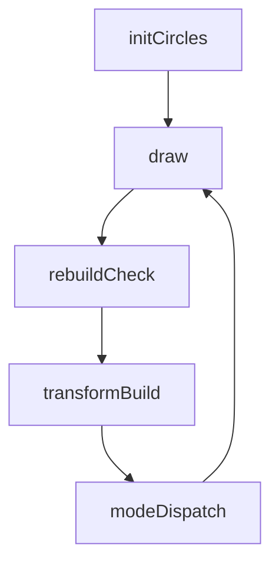

# circles — System Map

## Reference (v4 — 2026-04-23)

**Source:** `reference/generators/circles/source/circles.gen.js` (208 lines)  
**Mode:** 2D nested-orbit renderer  
**Coverage:** 3 units mapped, 0 not-relevant

### Lifecycle

### Function Call Graph

### Data Pathways

| pathway_id | input | transform chain | output | per-frame? | parallelisable? |
|---|---|---|---|---|---|
| P-01 | canvas size + count | radius ladder generation | circle chain state | on rebuild | no |
| P-02 | frame + cycleFrames | orbit transform propagation | per-circle transforms | yes | no (chain dependency) |
| P-03 | transforms + displayMode | mode-specific draw path | rendered frame | yes | partial |

### State Inventory

| name | scope | type | purpose | initialised by | mutated by |
|---|---|---|---|---|---|
| circles | module | Array<object> | chain radii/parent state | initCircles | initCircles |
| largestRadius | module | number | outer radius cache | initCircles | initCircles |
| radiusDecrement | module | number | spacing cache | initCircles | initCircles |

## Live (v4 — 2026-04-23)

**Source:** `assets/js/tools/generators/scripts/other/circles.gen.js` (209 lines)  
**Mode:** 2D nested-orbit renderer (closure-state)  
**Coverage:** 3 units mapped, 0 not-relevant

### Lifecycle

### Function Call Graph

### Data Pathways

| pathway_id | input | transform chain | output | per-frame? | parallelisable? |
|---|---|---|---|---|---|
| P-01 | canvas size + count | radius ladder generation | closure-held chain state | on rebuild | no |
| P-02 | frame + cycleFrames | orbit transform propagation with cached trig | per-circle transforms | yes | no (chain dependency) |
| P-03 | transforms + displayMode | mode-specific batched draw | rendered frame | yes | partial |

### State Inventory

| name | scope | type | purpose | initialised by | mutated by |
|---|---|---|---|---|---|
| _circles | closure | Array<object> | chain radii/parent state | initCircles | initCircles |
| _largestRadius | closure | number | outer radius cache | initCircles | initCircles |
| _radiusDecrement | closure | number | spacing cache | initCircles | initCircles |
| _prevW/_prevH | closure | number | rebuild-on-resize guard | initCircles | initCircles |

## Architectural Divergence Notes

- Live moves mutable module globals into closure state, reducing cross-instance leakage risk.
- Live batches lines-mode drawing and shares trig terms per frame; output behaviour remains equivalent.
- Live expands documentation/animation metadata while preserving reference control surface and render modes.
