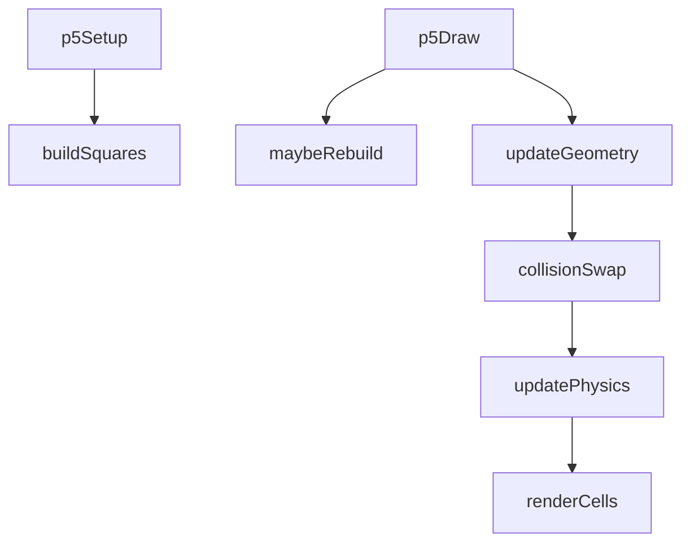
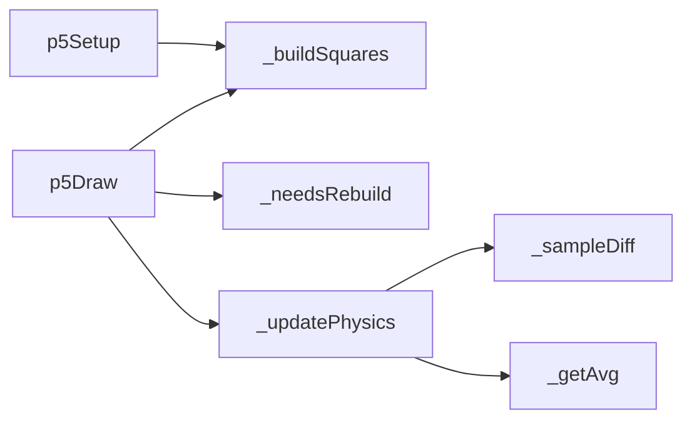
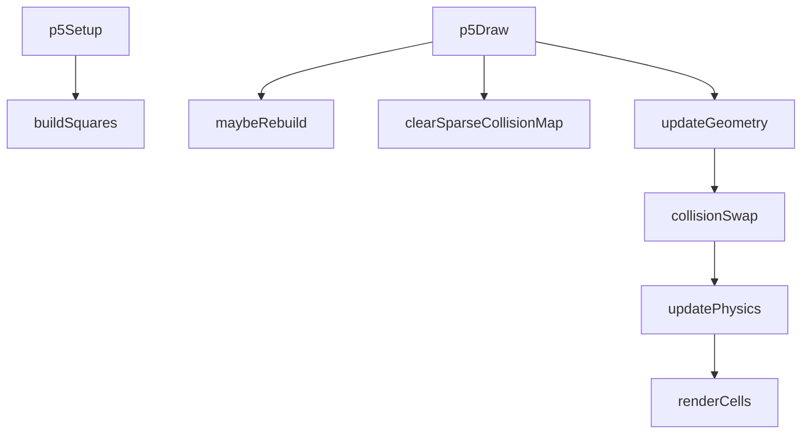

# clockwise — System Map

## Reference (v4 — 2026-04-23)

**Source:** `reference/generators/clockwise/source/clockwise.gen.js` (280 lines)  
**Mode:** p5 multi-square cellular orbit system  
**Coverage:** 8 units mapped, 0 not-relevant

### Lifecycle

### Function Call Graph

### Data Pathways

| pathway_id | input | transform chain | output | per-frame? | parallelisable? |
|---|---|---|---|---|---|
| P-01 | orbit/motion params | angular accumulators + polar->cartesian mapping | cell world positions | yes | yes (per-cell) |
| P-02 | field grids + physics params | neighbourhood average/diffusion + identity pull | next pulse/hue fields | yes | yes (per-cell) |
| P-03 | collision occupancy + cooldown | overlap detection + value swaps | cross-square field exchange | yes | partially (pixel-index contention) |

### State Inventory

| name | scope | type | purpose | initialised by | mutated by |
|---|---|---|---|---|---|
| `_squares` | SCRIPT_CONFIG | array | square grids + per-cell metadata | p5Setup/_buildSquares | p5Draw/_updatePhysics |
| `_collisionMap` | SCRIPT_CONFIG | flat array | per-pixel occupancy for overlaps | p5Setup | p5Draw clear/write |
| `_globalOrbitAngle` | SCRIPT_CONFIG | number | orbit phase accumulator | p5Setup | p5Draw |
| `_globalSpinAngle` | SCRIPT_CONFIG | number | spin phase accumulator | p5Setup | p5Draw |
| `_lastParams` | SCRIPT_CONFIG | object | rebuild guard snapshot | p5Setup | p5Draw on rebuild |

## Live (v4 — 2026-04-23)

**Source:** `assets/js/tools/generators/scripts/other/clockwise.gen.js` (330 lines)  
**Mode:** p5 multi-square cellular orbit system  
**Coverage:** same core flow with v1.1.0 safety/perf upgrades

### Lifecycle

### Function Call Graph

### Data Pathways

| pathway_id | input | transform chain | output | per-frame? | parallelisable? |
|---|---|---|---|---|---|
| P-01 | orbit/motion params | angular accumulators + polar->cartesian mapping | cell world positions | yes | yes (per-cell) |
| P-02 | field grids + physics params | neighbourhood average/diffusion + identity pull + pulse clamp | next pulse/hue fields | yes | yes (per-cell) |
| P-03 | collision occupancy + cooldown | sparse-map overlap detection + value swaps | cross-square field exchange | yes | partially (pixel-index contention) |

### State Inventory

| name | scope | type | purpose | initialised by | mutated by |
|---|---|---|---|---|---|
| `_squares` | SCRIPT_CONFIG | array | square grids + per-cell metadata | p5Setup/_buildSquares | p5Draw/_updatePhysics |
| `_collisionMap` | SCRIPT_CONFIG | Map | sparse per-pixel occupancy | p5Setup | p5Draw clear/write |
| `_globalOrbitAngle` | SCRIPT_CONFIG | number | orbit phase accumulator | p5Setup | p5Draw |
| `_globalSpinAngle` | SCRIPT_CONFIG | number | spin phase accumulator | p5Setup | p5Draw |
| `_lastParams` | SCRIPT_CONFIG | object | rebuild guard snapshot | p5Setup | p5Draw on rebuild |

## Architectural Divergence Notes

- Core generator mechanics retain parity between reference and live.
- Live upgrades include sparse collision map (`Map`) and pulse-field clamp in physics step.
- Live expands host metadata (`infoSections`, `export`, `compute`, `animatableParams`) without altering core simulation model.
