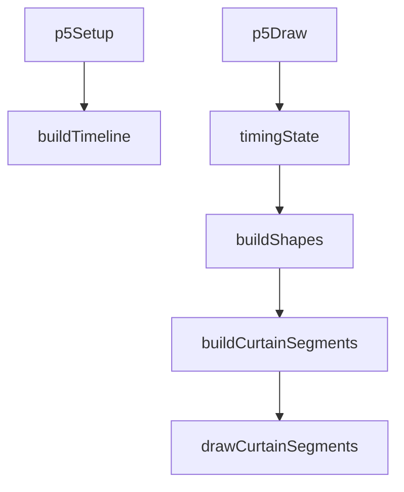
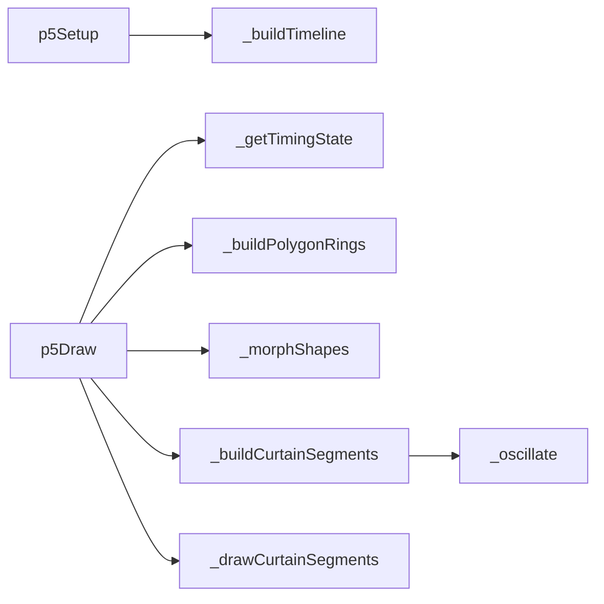

# curtain-morph — System Map

## Reference (v4 — 2026-04-23)

**Source:** `reference/generators/curtain-morph/source/curtain-morph.gen.js` (582 lines)  
**Mode:** p5 polygon morph + curtain extrusion renderer  
**Coverage:** 10 units mapped, 0 not-relevant

### Lifecycle

### Function Call Graph

### Data Pathways

| pathway_id | input | transform chain | output | per-frame? | parallelisable? |
|---|---|---|---|---|---|
| P-01 | shape/timeline params + frame | timeline segment lookup + polygon ring generation/morph | ring point sets | yes | yes (per-ring) |
| P-02 | ring points + wave params + lighting/extrusion params | normal displacement + side classification + segment partition | curtain segments | yes | yes (per-ring) |
| P-03 | segments + shading config | depth sort + extrusion + strip fill | rendered curtain frame | yes | limited (draw-order dependent) |

### State Inventory

| name | scope | type | purpose | initialised by | mutated by |
|---|---|---|---|---|---|
| `_timingState` | SCRIPT_CONFIG | object/null | cached timeline model | p5Setup | p5Draw on timing-key change |
| `_lastTmKey` | SCRIPT_CONFIG | string/null | rebuild guard for timing state | p5Setup | p5Draw |

## Live (v4 — 2026-04-23)

**Source:** `assets/js/tools/generators/scripts/other/curtain-morph.gen.js` (582 lines)  
**Mode:** p5 polygon morph + curtain extrusion renderer  
**Coverage:** equivalent to reference

### Lifecycle

### Function Call Graph

### Data Pathways

| pathway_id | input | transform chain | output | per-frame? | parallelisable? |
|---|---|---|---|---|---|
| P-01 | shape/timeline params + frame | timeline segment lookup + polygon ring generation/morph | ring point sets | yes | yes (per-ring) |
| P-02 | ring points + wave params + lighting/extrusion params | normal displacement + side classification + segment partition | curtain segments | yes | yes (per-ring) |
| P-03 | segments + shading config | depth sort + extrusion + strip fill | rendered curtain frame | yes | limited (draw-order dependent) |

### State Inventory

| name | scope | type | purpose | initialised by | mutated by |
|---|---|---|---|---|---|
| `_timingState` | SCRIPT_CONFIG | object/null | cached timeline model | p5Setup | p5Draw on timing-key change |
| `_lastTmKey` | SCRIPT_CONFIG | string/null | rebuild guard for timing state | p5Setup | p5Draw |

## Architectural Divergence Notes

- Reference and live generator code are currently equivalent in algorithm flow and runtime behaviour.
- Major outstanding divergence is documentation parity: docs describe v1.1.0 features that are not present in the actual live file.
