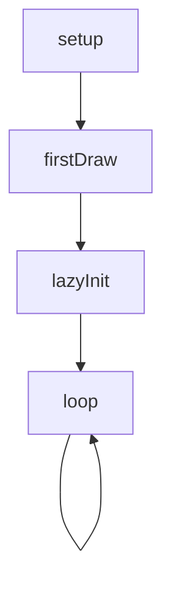
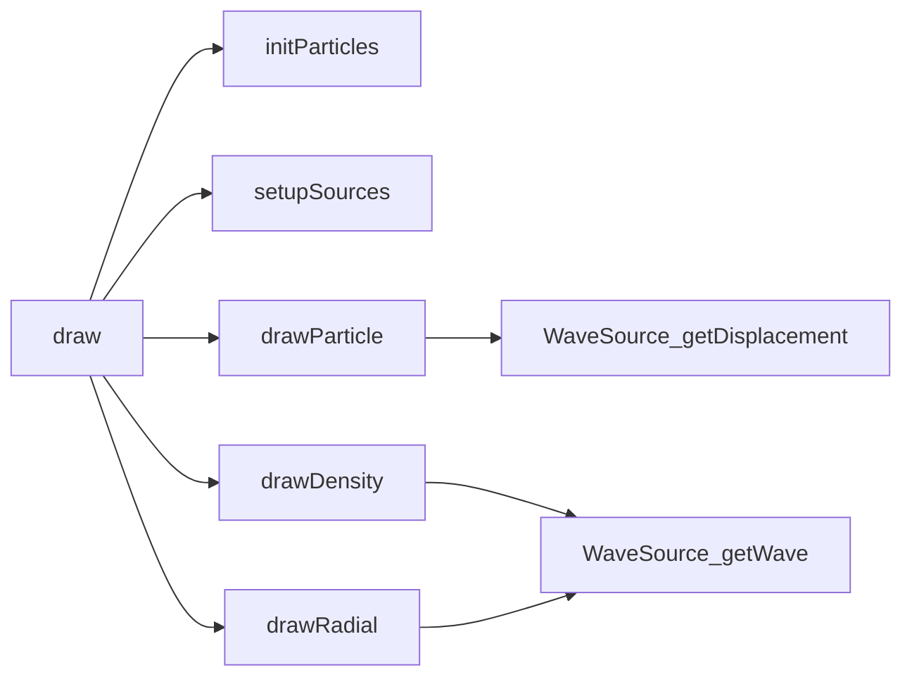
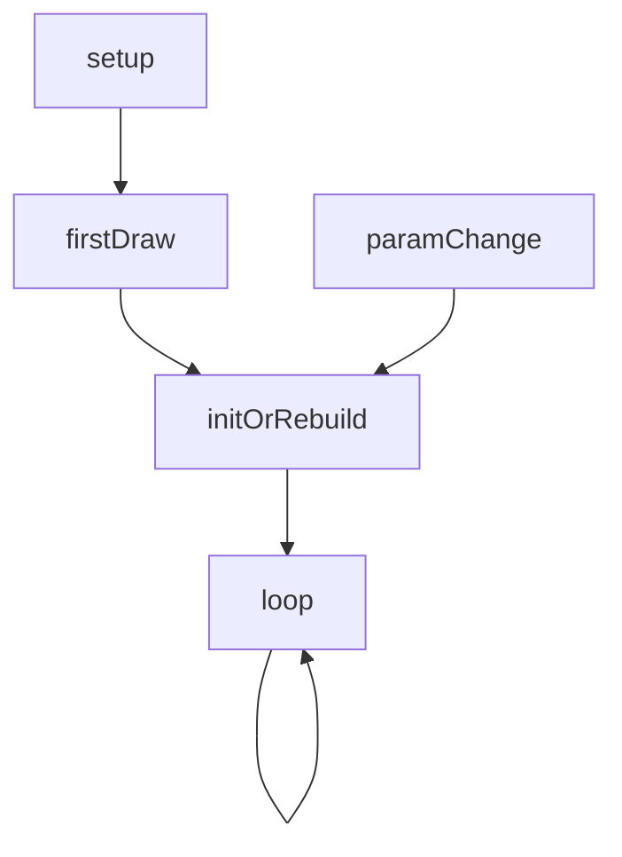
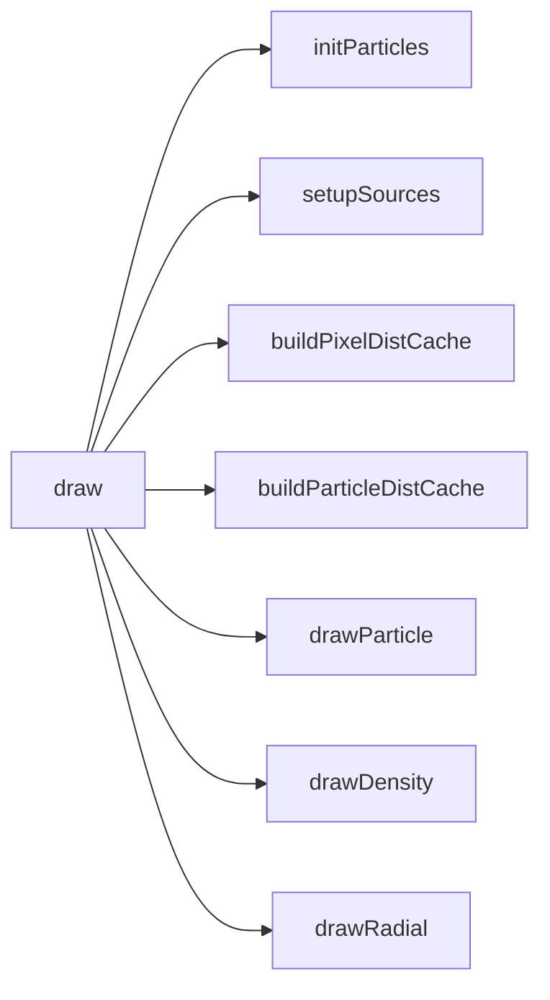

# cymatics — System Map

## Reference (v4 — 2026-04-23)

**Source:** `reference/generators/cymatics/source/cymatics.gen.js` (561 lines)  
**Mode:** canvas2d  
**Coverage:** 10 functions mapped, 0 not-relevant

### Lifecycle

### Function Call Graph

### Data Pathways

| pathway_id | input | transform chain | output | per-frame? | parallelisable? |
|---|---|---|---|---|---|
| P-01 | template + chord + root note | setupSources + semitone mapping | source array | init/rebuild | no (sequential state) |
| P-02 | source array + particle grid + time | displacement superposition | particle positions | yes | yes (per-particle) |
| P-03 | source array + pixels + time | intensity accumulation + normalise + gamma | density/radial pixels | yes | yes (per-pixel) |

### State Inventory

| name | scope | type | purpose | initialised by | mutated by |
|---|---|---|---|---|---|
| sources | module | Array<WaveSource> | active wave sources | setupSources | draw |
| particles | module | Array<object> | probe grid for particle mode | initParticles | drawParticle |
| t | module | number | time accumulator | draw | draw |

## Live (v4 — 2026-04-23)

**Source:** `assets/js/tools/generators/scripts/wave/cymatics.gen.js` (618 lines)  
**Mode:** canvas2d  
**Coverage:** 12 functions mapped, 0 not-relevant

### Lifecycle

### Function Call Graph

### Data Pathways

| pathway_id | input | transform chain | output | per-frame? | parallelisable? |
|---|---|---|---|---|---|
| P-01 | template/chord/spacing deltas | rebuild detector + setup + cache builders | refreshed sources/grid/caches | on change | no (sequential state) |
| P-02 | source cache + particle cache + time | displacement superposition without per-frame sqrt | particle positions | yes | yes (per-particle) |
| P-03 | pixel distance cache + source params + time | cached-distance intensity accumulation | density/radial pixels | yes | yes (per-pixel) |

### State Inventory

| name | scope | type | purpose | initialised by | mutated by |
|---|---|---|---|---|---|
| sources | module | Array<WaveSource> | active wave sources | setupSources | draw |
| particles | module | Array<object> | probe grid | initParticles | drawParticle |
| t | module | number | time accumulator | draw | draw |
| _pixelDistCache | module | Array<Float32Array> | per-source per-pixel distances | buildPixelDistCache | rebuild path |
| _partDistCache | module | Array<object> | per-source per-particle vectors/distances | buildParticleDistCache | rebuild path |
| _lastTemplate/_lastChordType/_lastParticleSpacing | module | string/number | rebuild change detection memory | draw | draw |

## Architectural Divergence Notes

- Live adds deterministic rebuild-on-change behaviour for `template`, `chordType`, and `particleSpacing`.
- Live introduces precomputed distance caches for particle and density/radial modes, replacing heavy repeated distance computation.
- Live migrates cleanup hook from `onDestroy` to standard `destroy` while keeping module-level mutable state model.
