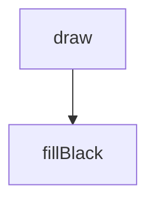
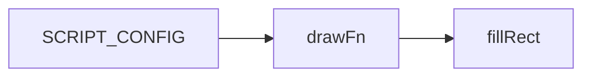
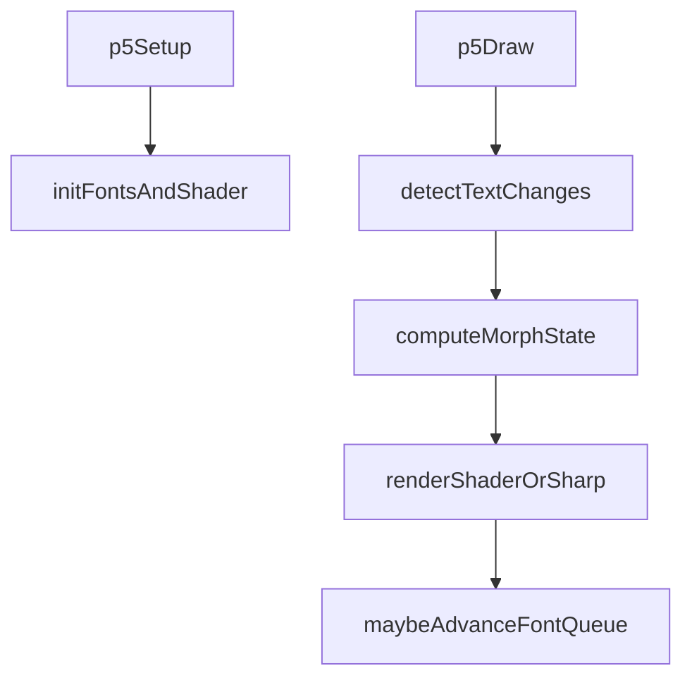
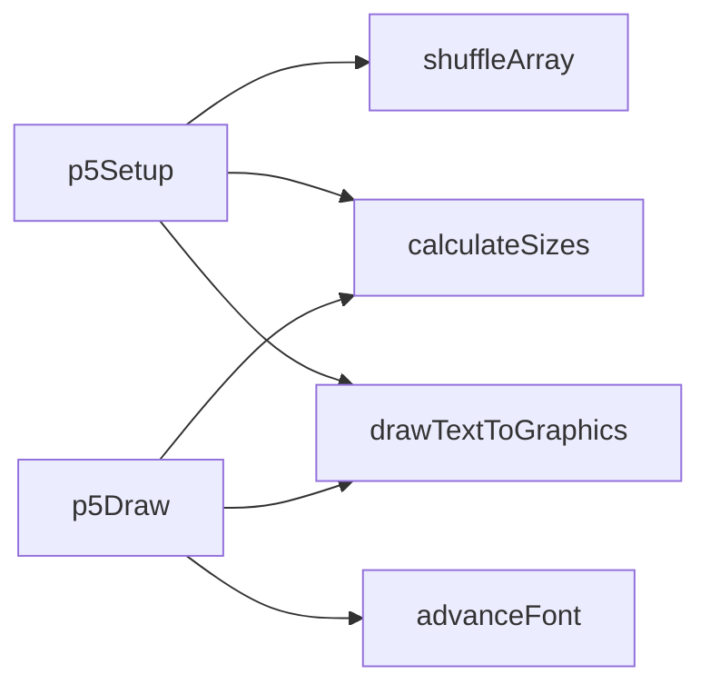

# defecated — System Map

## Reference (v4 — 2026-04-23)

**Source:** `reference/generators/defecated/source/defecated.gen.js` (22 lines)  
**Mode:** placeholder stub  
**Coverage:** 1 unit mapped, 0 not-relevant

### Lifecycle

### Function Call Graph

### Data Pathways

| pathway_id | input | transform chain | output | per-frame? | parallelisable? |
|---|---|---|---|---|---|
| P-01 | canvas/context | set fill + clear rect | black frame | yes | no |

### State Inventory

| name | scope | type | purpose | initialised by | mutated by |
|---|---|---|---|---|---|
| param | params | number | placeholder UI control | SCRIPT_CONFIG | host param changes |

## Live (v4 — 2026-04-23)

**Source:** `assets/js/tools/generators/scripts/other/defecated.gen.js` (376 lines)  
**Mode:** p5 WEBGL text morph shader system  
**Coverage:** full shader/font/timing pipeline

### Lifecycle

### Function Call Graph

### Data Pathways

| pathway_id | input | transform chain | output | per-frame? | parallelisable? |
|---|---|---|---|---|---|
| P-01 | text/layout params + font family | measure/scale/draw into offscreen gfx buffers | sharp source/target text textures | on change + cycle rollover | yes (per-line) |
| P-02 | elapsed wall-clock time + timing/effect params | power-ease morph state + blur/threshold mapping | shader uniforms | yes | no |
| P-03 | two text textures + shader uniforms | Gaussian blur + mix + alpha threshold | final WEBGL frame | yes | yes (GPU fragment parallelism) |

### State Inventory

| name | scope | type | purpose | initialised by | mutated by |
|---|---|---|---|---|---|
| `_fontNames` | SCRIPT_CONFIG | array | shuffled font catalogue | p5Setup | immutable after init |
| `_fontQueue` | SCRIPT_CONFIG | array | active/next font indices | p5Setup | `advanceFont` |
| `_shader` | SCRIPT_CONFIG | p5.Shader | morph shader program | p5Setup | reused |
| `_gfx1/_gfx2` | SCRIPT_CONFIG | p5.Graphics | source/target text buffers | p5Setup | swapped/redrawn each cycle |
| `_currentData/_nextData` | SCRIPT_CONFIG | object | measured text layout data | p5Setup | recalculated on change/cycle |
| `_startTime` | SCRIPT_CONFIG | number | morph cycle origin time | p5Setup | reset on change/cycle |
| `_lastTextSig` | SCRIPT_CONFIG | string | redraw signature cache | p5Setup | p5Draw |

## Architectural Divergence Notes

- Reference source is a minimal placeholder; live script is a full WebGL morph implementation.
- Divergence is intentional for functional completeness but requires explicit documentation parity and migration trace clarity.
- Live script still keeps all algorithms in-module with no shared-library extraction.
