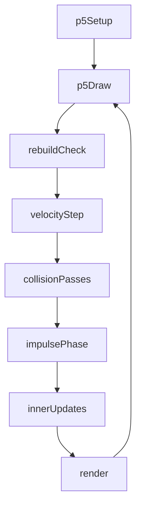
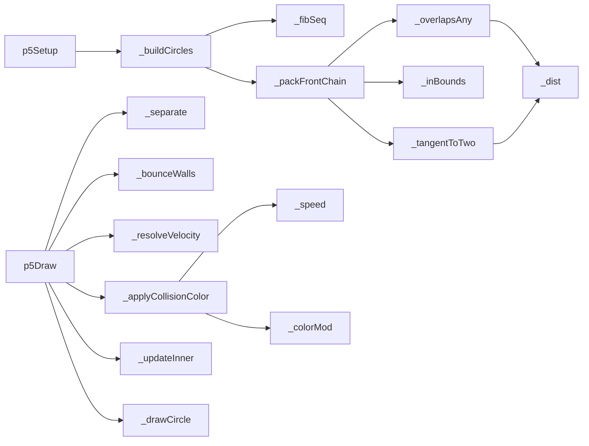
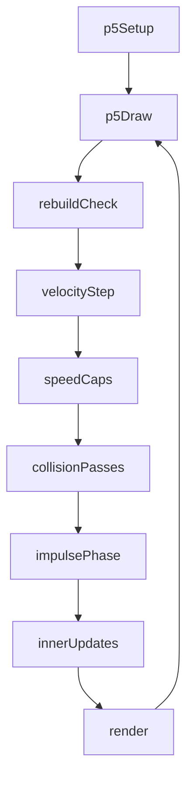
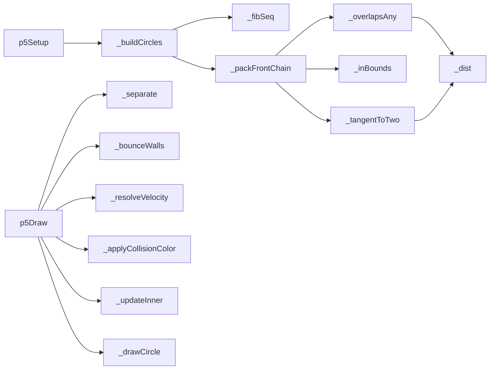

# fibonacci-balls — System Map

## Reference (v4 — 2026-04-23)

**Source:** `reference/generators/fibonacci-balls/source/fibonacci-balls.gen.js` (425 lines)  
**Mode:** p5 particle physics  
**Coverage:** 19 units mapped, 0 not-relevant

### Lifecycle

### Function Call Graph

### Data Pathways

| pathway_id | input | transform chain | output | per-frame? | parallelisable? |
|---|---|---|---|---|---|
| P-01 | Fibonacci indices | sequence build + packing | initial circle topology | on rebuild | no |
| P-02 | circle states + physics params | growth, separation, wall bounce, impulses | updated outer-circle states | yes | partial (pairwise constraints) |
| P-03 | parent/inner states + trail params | inner bounce + trail decay + draw | rendered frame | yes | partial (per-circle mostly independent) |

### State Inventory

| name | scope | type | purpose | initialised by | mutated by |
|---|---|---|---|---|---|
| _circles | SCRIPT_CONFIG | Array<object> | outer/inner simulation state | p5Setup | p5Draw/rebuild |
| _canvasSize | SCRIPT_CONFIG | number | simulation domain size | p5Setup | rebuild |
| _lastCfgKey | SCRIPT_CONFIG | string | rebuild guard | p5Setup | rebuild |

## Live (v4 — 2026-04-23)

**Source:** `assets/js/tools/generators/scripts/physics/fibonacci-balls.gen.js` (494 lines)  
**Mode:** p5 particle physics + bounded growth  
**Coverage:** 19 units mapped, 0 not-relevant

### Lifecycle

### Function Call Graph

### Data Pathways

| pathway_id | input | transform chain | output | per-frame? | parallelisable? |
|---|---|---|---|---|---|
| P-01 | Fibonacci indices | sequence build + packing | initial circle topology | on rebuild | no |
| P-02 | circle states + physics params | growth + outer speed cap + collision pipeline | bounded outer-circle states | yes | partial (pairwise constraints) |
| P-03 | parent/inner states + trail params | inner bounce + inner speed cap + draw | rendered frame | yes | partial (per-circle mostly independent) |

### State Inventory

| name | scope | type | purpose | initialised by | mutated by |
|---|---|---|---|---|---|
| _circles | SCRIPT_CONFIG | Array<object> | outer/inner simulation state | p5Setup | p5Draw/rebuild |
| _canvasSize | SCRIPT_CONFIG | number | simulation domain size | p5Setup | rebuild |
| _lastCfgKey | SCRIPT_CONFIG | string | rebuild guard | p5Setup | rebuild |

## Architectural Divergence Notes

- Live preserves reference topology/physics flow while adding speed caps to prevent high-growth tunnelling collapse.
- Live adds standards metadata (`export`, `animatableParams`, expanded info sections) without changing core capability set.
- Both reference and live keep mutable state on SCRIPT_CONFIG (known architecture debt).
