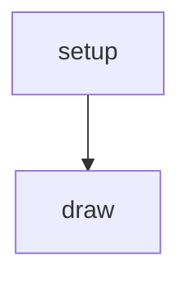
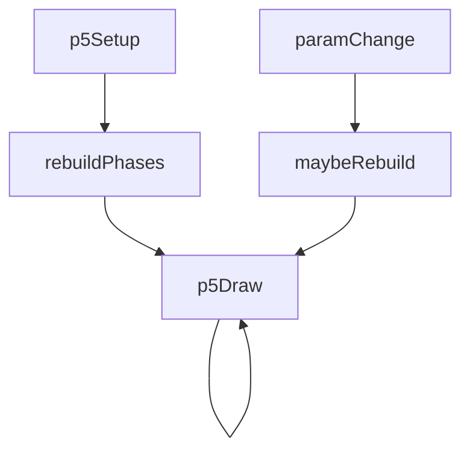
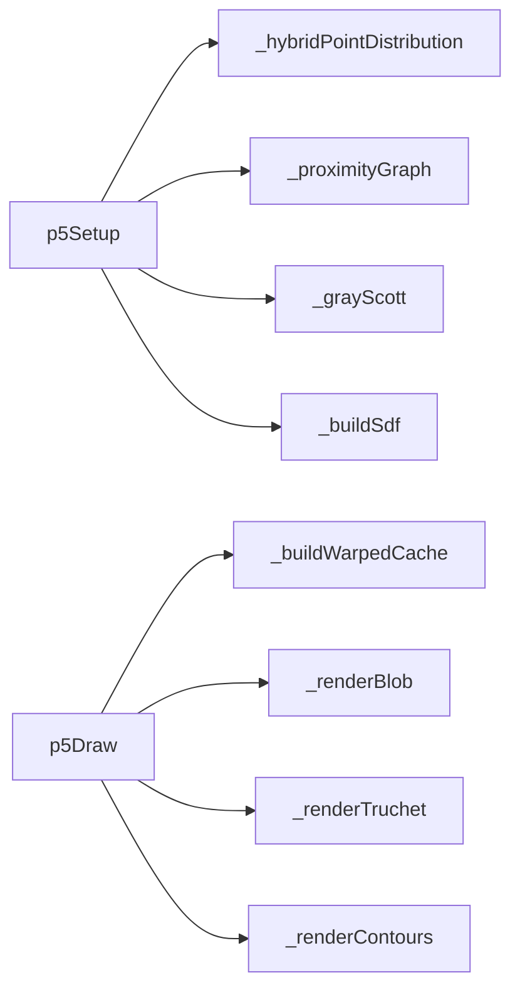

# generative-pattern — System Map

## Reference (v4 — 2026-04-23)

**Source:** `reference/generators/generative-pattern/source/generative-pattern.gen.js` (21 lines)  
**Mode:** canvas2d  
**Coverage:** 3 units mapped, 0 not-relevant

### Lifecycle

### Function Call Graph

### Data Pathways

| pathway_id | input | transform chain | output | per-frame? | parallelisable? |
|---|---|---|---|---|---|
| P-01 | canvas + params.complexity | black fill draw | black canvas | yes | n/a |

### State Inventory

| name | scope | type | purpose | initialised by | mutated by |
|---|---|---|---|---|---|
| (none) | — | — | reference source has no persistent state | — | — |

## Live (v4 — 2026-04-23)

**Source:** `assets/js/tools/generators/scripts/pattern/generative-pattern.gen.js` (817 lines)  
**Mode:** p5/canvas hybrid draw path  
**Coverage:** 10 units mapped, 0 not-relevant

### Lifecycle

### Function Call Graph

### Data Pathways

| pathway_id | input | transform chain | output | per-frame? | parallelisable? |
|---|---|---|---|---|---|
| P-01 | points params | hybrid distribution + graph build | point+edge topology | rebuild | no (sequential state) |
| P-02 | topology + evolution params | Gray-Scott + weighted edge distance | SDF grid | rebuild | partial (per-cell) |
| P-03 | SDF + animation params | warped lookup cache | warped SDF cache | yes | yes (per-cell) |
| P-04 | warped SDF + render mode | blob/truchet/contour renderers | frame pixels | yes | partial (mode dependent) |

### State Inventory

| name | scope | type | purpose | initialised by | mutated by |
|---|---|---|---|---|---|
| _points | SCRIPT_CONFIG | Array<object> | point set + RD state | setup/rebuild | RD/rebuild |
| _edges | SCRIPT_CONFIG | Array<object> | proximity graph edges | setup/rebuild | rebuild |
| _sdf | SCRIPT_CONFIG | Float32Array | base SDF field | setup/rebuild | rebuild |
| _offImg | SCRIPT_CONFIG | p5.Image | render scratch buffer | setup/rebuild | render path |
| _rngState | SCRIPT_CONFIG | number | deterministic RNG seed/state | setup/rebuild | _rng |

## Architectural Divergence Notes

- Reference is a placeholder stub; live is a full multi-phase generative system and is not feature-parity comparable at source level.
- Live introduces structural caches and rebuild keys not present in reference.
- Live render complexity and state model differ fundamentally from the minimal reference contract.
