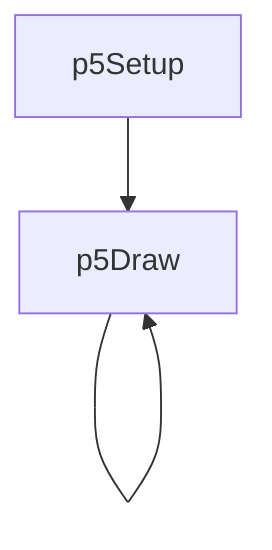
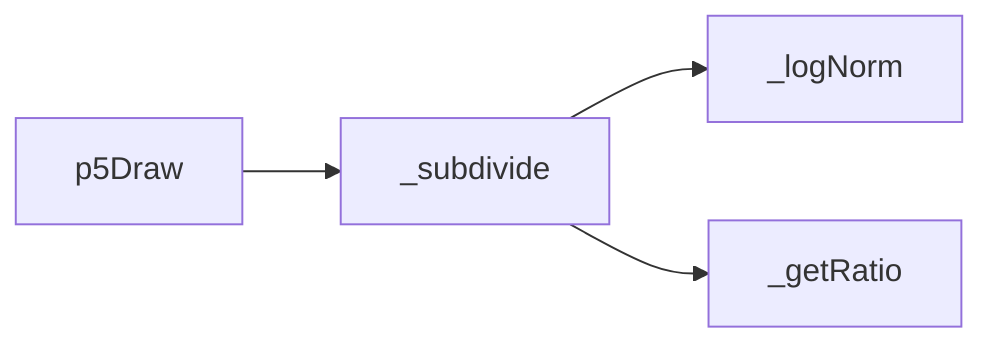
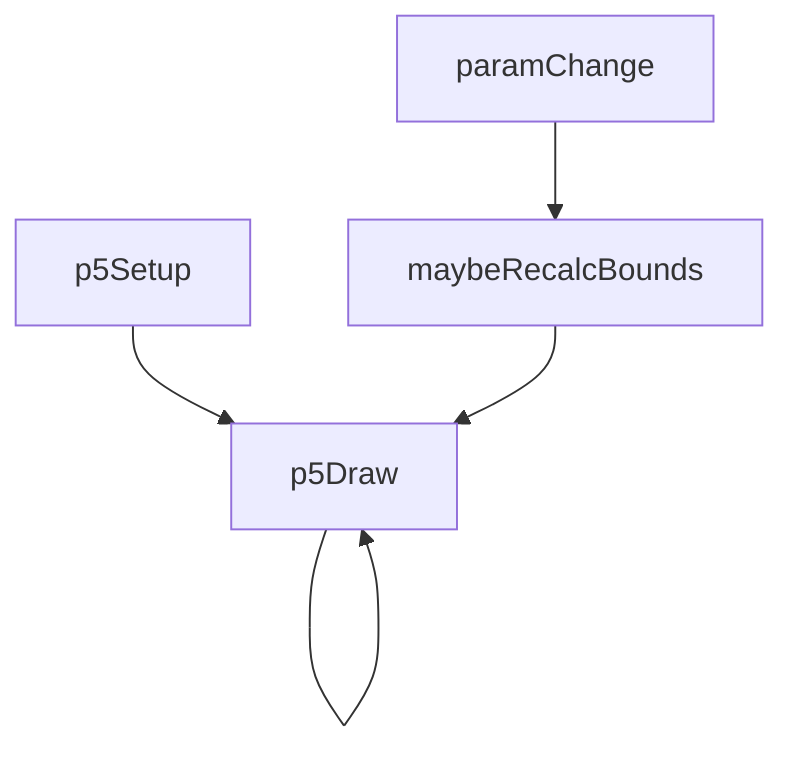
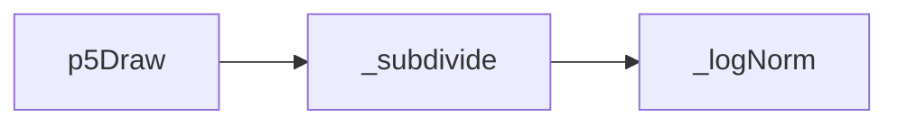

# golden-grid — System Map

## Reference (v4 — 2026-04-23)

**Source:** `reference/generators/golden-grid/source/golden-grid.gen.js` (218 lines)  
**Mode:** p5 HSL rect renderer  
**Coverage:** 6 units mapped, 0 not-relevant

### Lifecycle

### Function Call Graph

### Data Pathways

| pathway_id | input | transform chain | output | per-frame? | parallelisable? |
|---|---|---|---|---|---|
| P-01 | frame + loopFrames | oscillating split ratio | frame ratio | yes | no (sequential state) |
| P-02 | ratio + depth + flip state | recursive binary split tree | terminal cell geometry | yes | partial (tree branches) |
| P-03 | cell proportions + animation speeds | HSL mapping + p.rect | final frame | yes | partial (leaf nodes) |

### State Inventory

| name | scope | type | purpose | initialised by | mutated by |
|---|---|---|---|---|---|
| _normBounds | SCRIPT_CONFIG | object | setup-computed normalisation bounds | p5Setup | p5Setup |

## Live (v4 — 2026-04-23)

**Source:** `assets/js/tools/generators/scripts/pattern/golden-grid.gen.js` (179 lines)  
**Mode:** p5 HSL rect renderer  
**Coverage:** 7 units mapped, 0 not-relevant

### Lifecycle

### Function Call Graph

### Data Pathways

| pathway_id | input | transform chain | output | per-frame? | parallelisable? |
|---|---|---|---|---|---|
| P-01 | frame + loopFrames | oscillating split ratio (cached per frame) | frame ratio | yes | no (sequential state) |
| P-02 | ratio + depth + flip state | recursive binary split tree | terminal cell geometry | yes | partial (tree branches) |
| P-03 | cell proportions + animation speeds | HSL mapping + p.rect | final frame | yes | partial (leaf nodes) |
| P-04 | maxDepth changes | bounds recomputation + cache update | cached bounds | on change | no (sequential state) |

### State Inventory

| name | scope | type | purpose | initialised by | mutated by |
|---|---|---|---|---|---|
| _cachedBounds | SCRIPT_CONFIG | object | depth-dependent normalisation bounds | p5Draw (guarded) | p5Draw |
| _lastMaxDepth | SCRIPT_CONFIG | number | cache invalidation key | p5Draw | p5Draw |
| _liveLoopFrames | SCRIPT_CONFIG | number | animation.loopFrames getter source | p5Draw | p5Draw |

## Architectural Divergence Notes

- Live removes per-node ratio recomputation by passing a per-frame cached ratio into recursion.
- Live moves bounds computation from setup to guarded per-depth cache in draw.
- Live resolves loopFrames export mismatch through dynamic animation.loopFrames getter syncing to params.
