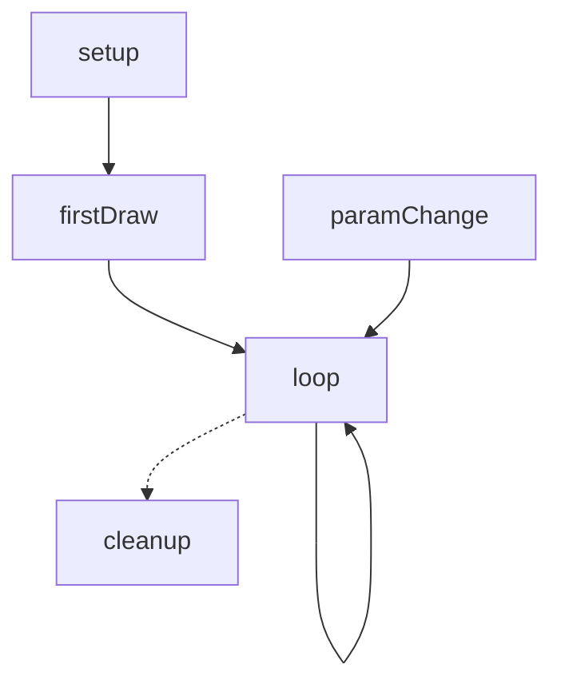
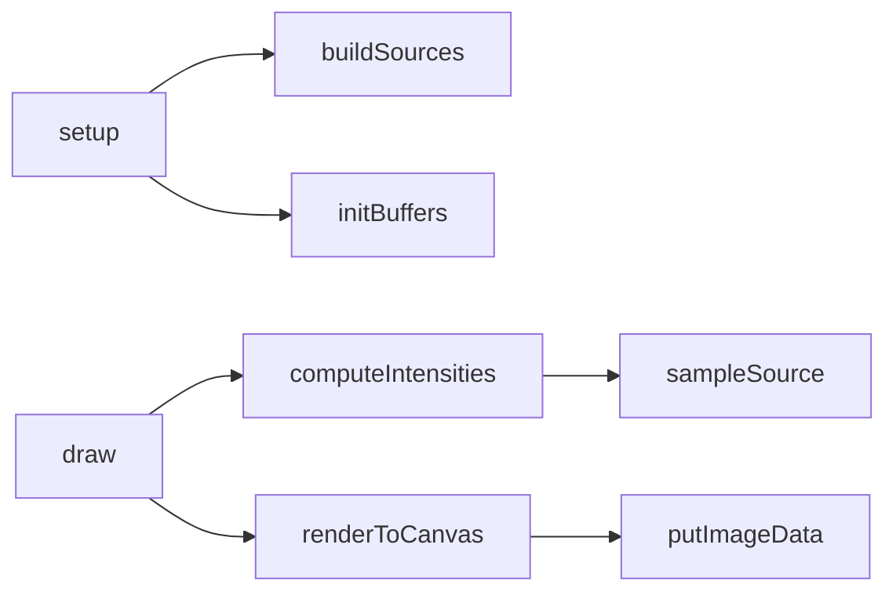

# Card 07 — Phase 1 Stage B.5 — REFERENCE SYSTEM MAP

## What this stage does
Builds the four-part System Map for the **reference** source: Lifecycle flowchart, Function Call Graph, Data Pathways table, State Inventory table. Writes the Reference half of `<id>/system-map.md`. This is a permanent artefact reused for future GPU porting, worker boundary placement, regression hunting.

## Applicable rules
Operating: R5 (one card at a time). Anti-Fab: F.1 (cite file:line for any cross-reference), F.3 (function names from source). Anti-pattern numbers: 5 (no skipping), 6 (no prose).

## Inputs
- Reference source (in context)
- Reference Capability Table (in context from Stage B)
- Function Coverage Map (in context from Stage B)
- **Read now**: `blog/docs/pages/tools/generators/guides/v4/system-map-authoring.md` — the full standard. Re-Read every Stage B.5; this is load-bearing.

## Outputs
- `blog/docs/pages/tools/generators/<id>/system-map.md` — Reference half written under `## Reference (v4 — <date>)` heading

## Procedure

- [ ] 1. Update v4-state.md: `stage: B.5`, append checkpoint.
- [ ] 2. Read `blog/docs/pages/tools/generators/guides/v4/system-map-authoring.md` IN FULL. The standard governs every choice in this stage.
- [ ] 3. Determine `Mode:` value for the reference source. Inspect imports/setup. One of: `p5-instance`, `p5-global`, `canvas2d`, `webgl`, `webgl2`, `webgpu`, `html-embedded-sketch`, `other:<spec>`. (The Mode vocabulary is closed; if you need something else, queue Q.)
- [ ] 4. Build **Lifecycle Flowchart** (mermaid `flowchart TD`). Use only canonical nodes (`setup`, `firstDraw`, `loop`, `paramChange`, `cleanup`). Omit nodes the generator doesn't have. Edges follow real call relationships. RULE: no `style`, no `classDef`, no edge labels except for conditional dispatches.
- [ ] 5. Build **Function Call Graph** (mermaid `flowchart LR`). One node per Coverage Map row mapped to a cap_id (exclude `not-relevant`; exclude library calls; inline ≤5-line single-caller helpers per Standard rules). Edges = direct calls. If > 20 nodes → partition into `subgraph init`, `subgraph perframe`, `subgraph event`, `subgraph cleanup`.
- [ ] 6. Build **Data Pathways table**. One row per logical data pipeline. Columns: `pathway_id`, `input`, `transform chain`, `output`, `per-frame?`, `parallelisable?`. RULE: `parallelisable?` must use the closed vocabulary (`yes (per-pixel)`, `yes (per-vertex)`, `yes (per-particle)`, `yes (embarrassingly)`, `partial (per-row)`, `partial (per-band)`, `no (sequential state)`, `n/a`). This column feeds Stage E.6 — get it right.
- [ ] 7. Build **State Inventory table**. One row per piece of mutable state. Columns: `name`, `scope`, `type`, `purpose` (≤12 words), `initialised by`, `mutated by`. `mutated by` empty list is forbidden — write `(immutable)` explicitly. `scope` from closed vocabulary (`module`, `module-const`, `instance`, `closure`, `host`, `external`).
- [ ] 8. **Run Quality Gates** from the Standard. The 11 gates are reproduced below for convenience. Fix any failure before proceeding.
- [ ] 9. Write the Reference half of `system-map.md` from the template below. If the file doesn't exist, Write it (the file is structurally Reference + Live + Divergence — the Live and Divergence sections will be appended in Stage C.5; placeholder OK for now? NO — write only the Reference section; the file is not "complete" until C.5 finishes. Use Write the first time, StrReplace if the file already had a v3 stub).
- [ ] 10. Update v4-state.md: `stage: C`, `last_action: reference system map written`, `next_action: extract live capabilities`, append checkpoint.
- [ ] 11. Read card `08-p1-stage-C.md` — auto-advance.

## Quality Gates (run before writing system-map.md)

- [ ] Heading set matches Standard template exactly (no extra, no missing)
- [ ] `**Source:**` line cites a path that exists (re-Glob if uncertain)
- [ ] `**Mode:**` value from closed set
- [ ] Lifecycle uses only canonical node names
- [ ] Call Graph node count = (Coverage Map mapped count) − (inlined-into count). Off-by-one fails.
- [ ] Every Data Pathway `parallelisable?` value from closed vocabulary
- [ ] Every State Inventory `scope` value from closed vocabulary
- [ ] Every State Inventory row with `scope: module` is a known smell — note it; will be cross-checked in Stage E.5
- [ ] No mermaid diagram contains `style`, `classDef`, `linkStyle`, or HTML
- [ ] Architectural Divergence section header exists (will be filled by Stage C.5; for now, leave the heading present with placeholder `(populated in Stage C.5)`)
- [ ] All cross-references resolve (cap_id exists in Capability Table; file:line exists in cited file)

## Templates

### system-map.md — Reference half (Live half added in Stage C.5)

```markdown
# <generator-id> — System Map

## Reference (v4 — <YYYY-MM-DD>)

**Source:** `<reference path>` (<line count> lines)
**Mode:** <mode>
**Coverage:** <N functions mapped, M not-relevant>

### Lifecycle



### Function Call Graph



### Data Pathways

| pathway_id | input | transform chain | output | per-frame? | parallelisable? |
|---|---|---|---|---|---|
| P-01 | params.template | buildSources | sources:Array<{x,y}> | no | n/a |
| P-02 | sources:Array<{x,y}>, params.frequency, frame.t | computeIntensities → sampleSource | intensities:Float32Array | yes | yes (per-pixel) |
| P-03 | intensities:Float32Array, params.boost | renderToCanvas → putImageData | canvasPixels:ImageData | yes | yes (per-pixel) |

### State Inventory

| name | scope | type | purpose | initialised by | mutated by |
|---|---|---|---|---|---|
| sources | module | Array<{x,y}> | source positions | buildSources | buildSources |
| intensityBuffer | module | Float32Array | per-frame compute output | initBuffers | computeIntensities |
| frame | host | number | frame counter | host | host |

## Live (v4 — <date>)

(populated in Stage C.5)

## Architectural Divergence Notes

(populated in Stage C.5)
```

## Validation

```bash
test -f blog/docs/pages/tools/generators/<id>/system-map.md && \
rg -c "^## Reference \(v4" blog/docs/pages/tools/generators/<id>/system-map.md && \
rg -c "^### (Lifecycle|Function Call Graph|Data Pathways|State Inventory)" blog/docs/pages/tools/generators/<id>/system-map.md && \
echo "OK reference half present"
```

Expect: `## Reference` count = 1; `### sub-headings` count = 4.

## Halt-and-recover

| Trigger | Recovery |
|---|---|
| Quality Gate fails | Re-read system-map-authoring.md. Identify which specific gate. Fix only that. Re-run all 11 gates. Maximum 3 attempts; if persistent, queue BLOCK Q-system-map-gate-<id>. |
| Mode does not fit closed vocabulary | Use `other:<short-spec>` (e.g. `other:audio-visual-canvas`). Queue OBSERVE Q-mode-extension-<spec> for catalogue extension. |
| `parallelisable?` value not in vocabulary | This is a closed set. Re-classify by re-reading source. If genuinely doesn't fit, queue BLOCK Q-parallelisable-extension. |
| Reference source has no per-frame loop (e.g. pure SVG generator that draws once) | Lifecycle has `setup → firstDraw → cleanup` only (no `loop`). Data Pathways `per-frame?` all `no`, all `parallelisable?` `n/a`. This is valid. |

## Exit criteria

- [ ] system-map.md exists with `## Reference (v4 — <date>)` section
- [ ] All 4 reference sub-sections present (Lifecycle, Call Graph, Data Pathways, State Inventory)
- [ ] All 11 Quality Gates pass
- [ ] `## Live` and `## Architectural Divergence` headings present (with placeholder text)
- [ ] v4-state.md updated; `stage: C`

## Next card

`blog/docs/pages/tools/generators/guides/v4/stages/08-p1-stage-C.md`
