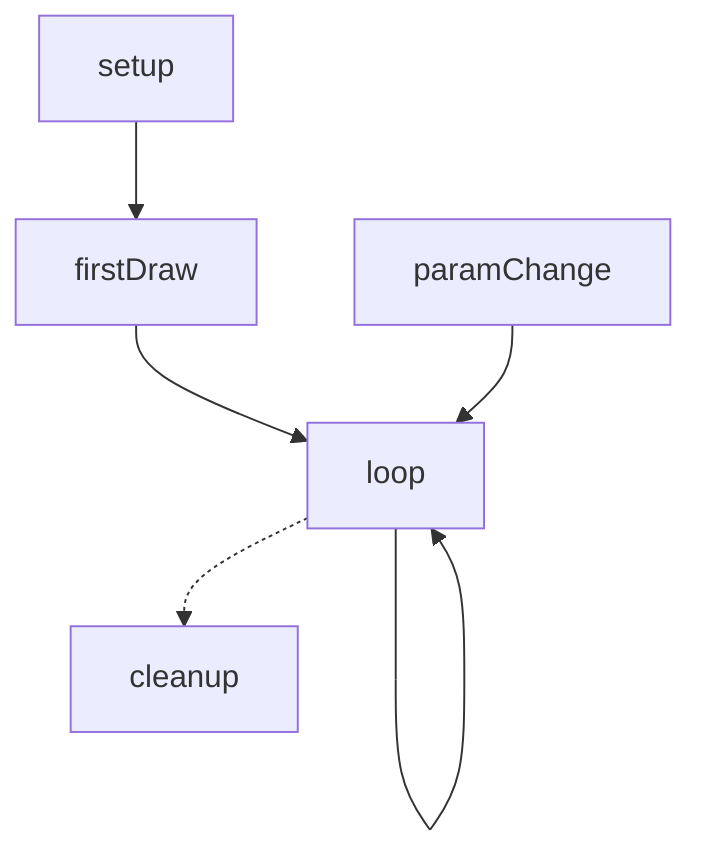
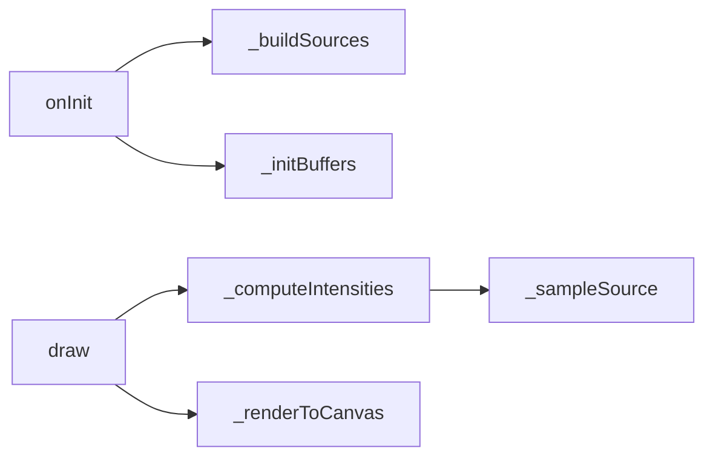

# Card 09 — Phase 1 Stage C.5 — LIVE SYSTEM MAP + ARCHITECTURAL DIVERGENCE

## What this stage does
Builds the four-part System Map for the **live** source (same structure as B.5). Then writes the Architectural Divergence Notes section comparing live structure to reference structure. Appends Live and Divergence sections to the existing `system-map.md`.

## Applicable rules
Operating: R5, R10. Anti-Fab: F.1, F.3, F.4. Anti-pattern numbers: 5, 6, 18 (additive only — Reference half from B.5 is not edited).

## Inputs
- Live source (in context)
- Live Capability Table (in context from Stage C)
- Reference half of system-map.md (in context from B.5)
- `blog/docs/pages/tools/generators/guides/v4/system-map-authoring.md` (re-Read this turn — load-bearing)

## Outputs
- `system-map.md` updated with Live half + Divergence Notes (Reference half preserved)

## Procedure

- [ ] 1. Update v4-state.md: `stage: C.5`, append checkpoint.
- [ ] 2. Read system-map-authoring.md again (it was read in B.5; if context is short, re-Read).
- [ ] 3. **Build Function Coverage Map for live source.** Same procedure as Stage B step 4-6 but applied to the live `.gen.js`. (This isn't a separately-logged artefact; it's used to drive the Live Call Graph node count.)
- [ ] 4. Determine `Mode:` for live. Almost always `canvas2d` for non-p5 generators, `p5-instance` or `p5-global` for p5 generators, `webgl2` if live uses raw WebGL2 (rare per current state of code), `webgpu` if live uses WebGPU (zero generators do this currently).
- [ ] 5. Build **Lifecycle Flowchart** for live. Live generators have host-managed lifecycle — typical nodes: `setup` (= `onInit`), `firstDraw` (= first `draw`/`p5Draw`), `loop` (= per-frame `draw`/`p5Draw`), `paramChange` (= `onParamChange` if defined), `cleanup` (= `destroy` if defined). Omit nodes not present.
- [ ] 6. Build **Function Call Graph** for live. One node per live Coverage Map row mapped to a cap_id. Edges from method calls within `.gen.js`. Exclude calls to host (`host.frame`, `host.params`) and library calls.
- [ ] 7. Build **Data Pathways table** for live. Stable `pathway_id`s with reference where pathway purpose matches (e.g. live's "compute density" pathway uses the same `P-02` as reference's). Live-only pathways get next free id (`P-XX` after the highest reference id).
- [ ] 8. Build **State Inventory table** for live. Pay attention to `instance` vs `module` scope distinction — the live BaseComponent extension typically pushes state to `instance` (good); any `module` scope live state is a smell.
- [ ] 9. **Run Quality Gates** (11 checks from system-map-authoring.md) on the Live half.
- [ ] 10. **Write Architectural Divergence Notes**. Bullet list. One bullet per distinct structural difference. Examples (from sub-guide):
  - Caching layers in live not in reference (e.g. `_pixelDistCache` precomputation)
  - Indirection differences (e.g. live uses ComputeScheduler between `draw` and per-pixel work)
  - Framework substitutions (e.g. reference uses `mousePressed`, live uses `host.canvas.addEventListener`)
  - State expansions (live has more module/instance state)
  - Pathway split/merge (e.g. reference has two-phase per-frame, live has single-pass)
- [ ] 11. **Forbidden bullets**: those that merely restate Diff Table rows. The Diff Table covers capability gaps; this section covers structural gaps.
- [ ] 12. **If reference and live are structurally identical**: write the single bullet `- No architectural divergence — live is a faithful port of reference.` Do not omit the section.
- [ ] 13. StrReplace the placeholder `(populated in Stage C.5)` text under `## Live (v4 — <date>)` and `## Architectural Divergence Notes` with the new content. Use Read to confirm the Reference half is preserved untouched.
- [ ] 14. Re-run Quality Gates over the full system-map.md.
- [ ] 15. Update v4-state.md: `stage: D`, `last_action: live system map and divergence written`, `next_action: build diff table`, append checkpoint.
- [ ] 16. Read card `10-p1-stage-D.md` — auto-advance.

## Templates

### Live half template (replaces placeholder)

```markdown
## Live (v4 — <YYYY-MM-DD>)

**Source:** `assets/js/tools/generators/scripts/<category>/<id>.gen.js` (<line count> lines)
**Mode:** <mode>
**Coverage:** <N functions mapped, M not-relevant>

### Lifecycle



### Function Call Graph



### Data Pathways

| pathway_id | input | transform chain | output | per-frame? | parallelisable? |
|---|---|---|---|---|---|
| P-01 | params.template | _buildSources | sources:Array<{x,y}> | no | n/a |
| P-02 | sources:Array<{x,y}>, params.frequency, frame.t | _computeIntensities → _sampleSource | intensities:Float32Array | yes | yes (per-pixel) |
| P-03 | intensities:Float32Array, params.boost | _renderToCanvas → host.ctx.putImageData | canvasPixels:ImageData | yes | yes (per-pixel) |
| P-04 | params.cacheKey | _buildPixelDistCache | pixelDistCache:Float32Array | no | n/a |
```

### Architectural Divergence Notes template

```markdown
## Architectural Divergence Notes

- Live introduces `_pixelDistCache: Float32Array` precomputed in `_buildPixelDistCache()` (live State Inventory row); reference recomputes sqrt every pixel-frame. Pathway P-04 is live-only. See `performance.md` line 80.
- Reference uses `mousePressed()` (p5 global) to add sources; live moves source placement to template-only param dispatch (no live equivalent of mouse interaction). See Diff R-04 status `absent` (GEN P1 to be logged in Stage F).
- Live splits reference's monolithic `draw()` into three SCRIPT_CONFIG-level mode branches via `mode` param dispatch in `_renderToCanvas`. Logic equivalent; cleaner separation. No issue.
```

## Quality Gates (re-run on Live half + full file)

(Same 11 gates as B.5, applied to Live half. Plus: `## Reference` section is preserved untouched.)

- [ ] Reference section unchanged (compare to original — agent should NOT have touched it)
- [ ] Live section heading set matches Standard
- [ ] Live `Source:` cites a path that exists
- [ ] Live `Mode:` from closed set
- [ ] Live Lifecycle uses canonical nodes only
- [ ] Live Call Graph node count = (Live Coverage Map mapped count) − (inlined-into count)
- [ ] Live Data Pathway `parallelisable?` from closed vocabulary
- [ ] Live State Inventory `scope` from closed vocabulary
- [ ] No mermaid contains `style`/`classDef`/HTML
- [ ] Architectural Divergence section present (with content or single "no divergence" bullet)
- [ ] All cross-references resolve

## Validation

```bash
rg -c "^## (Reference|Live|Architectural Divergence)" blog/docs/pages/tools/generators/<id>/system-map.md
# expect: 3
rg -c "^### (Lifecycle|Function Call Graph|Data Pathways|State Inventory)" blog/docs/pages/tools/generators/<id>/system-map.md
# expect: 8 (4 in Reference + 4 in Live)
rg "(populated in Stage C.5)" blog/docs/pages/tools/generators/<id>/system-map.md
# expect: zero matches (placeholders all replaced)
```

## Halt-and-recover

| Trigger | Recovery |
|---|---|
| StrReplace can't find placeholder text | Re-Read system-map.md, find unique surrounding context, retry. If file structure was corrupted in B.5, fix structure first. |
| Quality Gate fails on Live half | Same as B.5 recovery: re-read Standard, identify failed gate, fix. |
| No structural difference between ref and live (truly identical) | Single bullet `- No architectural divergence — live is a faithful port of reference.` is correct. Do not invent divergence. |
| Live has wildly different structure (e.g. live is class-based; reference is procedural) | This is significant divergence. Multiple bullets in Architectural Divergence Notes are expected. |

## Exit criteria

- [ ] system-map.md has all three sections (Reference, Live, Divergence) populated
- [ ] No `(populated in Stage C.5)` placeholders remain
- [ ] All Quality Gates pass on full file
- [ ] v4-state.md updated; `stage: D`

## Next card

`blog/docs/pages/tools/generators/guides/v4/stages/10-p1-stage-D.md`
