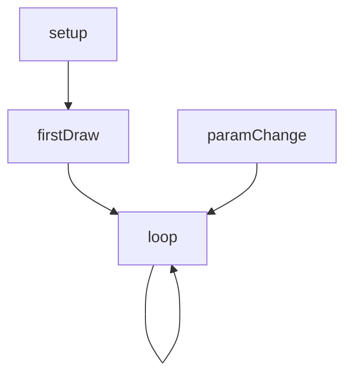
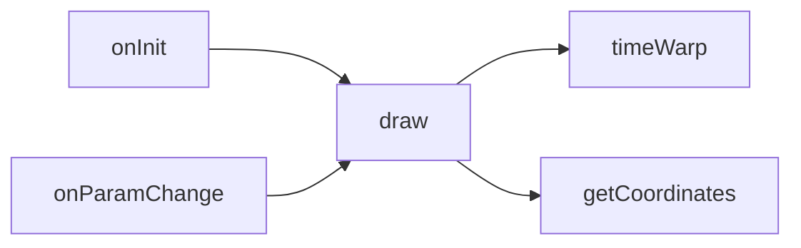
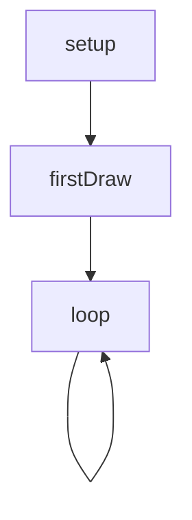
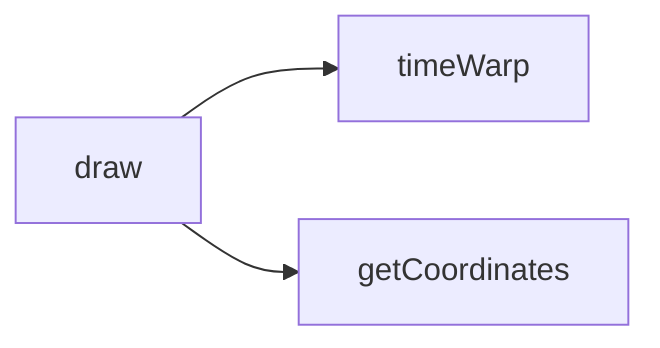

# harmonics — System Map

## Reference (v4 — 2026-04-23)

**Source:** `reference/generators/harmonics/source/harmonics.gen.js` (318 lines)  
**Mode:** canvas2d  
**Coverage:** 8 functions mapped, 0 not-relevant

### Lifecycle

### Function Call Graph

### Data Pathways

| pathway_id | input | transform chain | output | per-frame? | parallelisable? |
|---|---|---|---|---|---|
| P-01 | params.passDuration, elapsed | pass segmentation + interpolation | passIndex/viewProgress/currentRatio | yes | no (sequential state) |
| P-02 | currentRatio, points, view mode | getCoordinates loop | point coordinates | yes | yes (per-particle) |
| P-03 | motionBlur, pointSize | trail clear + particle draw | canvas pixels | yes | partial (per-row) |

### State Inventory

| name | scope | type | purpose | initialised by | mutated by |
|---|---|---|---|---|---|
| startTime | module | number/null | wall-clock cycle anchor | onInit | onInit |
| passDuration | module | number | pass timing control | onInit | onParamChange |
| totalCycleDuration | module | number | full cycle duration | onInit | onParamChange |
| intervals | module-const | Array<[number,number]> | musical ratio catalogue | top-level | (immutable) |
| views | module-const | string[] | view mode order | top-level | (immutable) |

## Live (v4 — 2026-04-23)

**Source:** `assets/js/tools/generators/scripts/parametric/harmonics.gen.js` (293 lines)  
**Mode:** canvas2d  
**Coverage:** 8 functions mapped, 0 not-relevant

### Lifecycle

### Function Call Graph

### Data Pathways

| pathway_id | input | transform chain | output | per-frame? | parallelisable? |
|---|---|---|---|---|---|
| P-01 | frame, fps, params.passDuration | frame-derived pass segmentation + interpolation | passIndex/viewProgress/currentRatio | yes | no (sequential state) |
| P-02 | currentRatio, points, view mode | getCoordinates loop | point coordinates | yes | yes (per-particle) |
| P-03 | motionBlur, pointSize | globalAlpha clear + fillRect/arc batch draw | canvas pixels | yes | partial (per-row) |

### State Inventory

| name | scope | type | purpose | initialised by | mutated by |
|---|---|---|---|---|---|
| intervals | module-const | Array<[number,number]> | musical ratio catalogue | top-level | (immutable) |
| views | module-const | string[] | view mode order | top-level | (immutable) |
| SCRIPT_CONFIG.animation.loopFrames | module | number | host export planning loop length | SCRIPT_CONFIG | draw |

## Architectural Divergence Notes

- Live removes the reference lifecycle hooks (`onInit`, `onParamChange`) and derives timing from `frame/fps` directly inside `draw`.
- Live removes mutable module timing state (`startTime`, `passDuration`, `totalCycleDuration`) and recomputes cycle timing per frame from params.
- Live renderer introduces a split path (`fillRect` for sub-pixel points, batched `arc` for larger points) rather than the reference's always-arc path.
