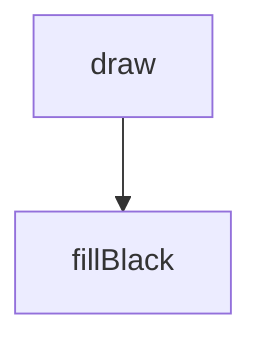
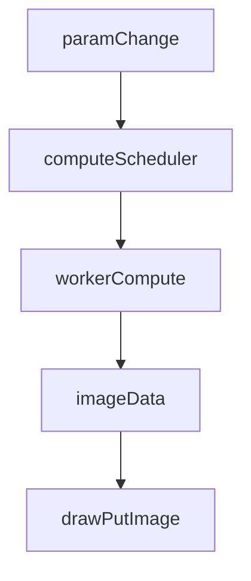
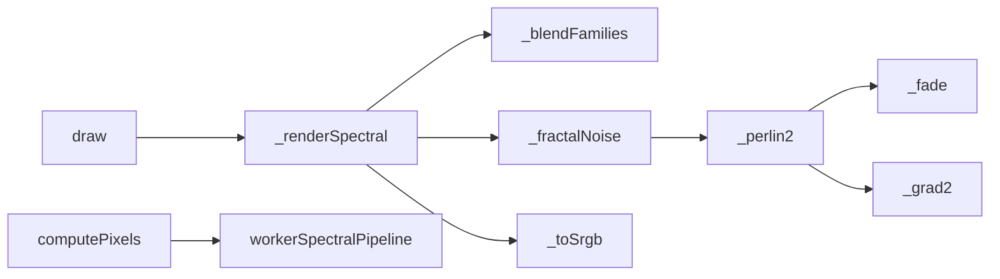

# interference-figure — System Map

## Reference (v4 — 2026-04-23)

**Source:** `reference/generators/interference-figure/source/interference-figure.gen.js` (21 lines)  
**Mode:** placeholder stub  
**Coverage:** 1 unit mapped, 0 not-relevant

### Lifecycle

### Function Call Graph

### Data Pathways

| pathway_id | input | transform chain | output | per-frame? | parallelisable? |
|---|---|---|---|---|---|
| P-01 | canvas/context | set fill + clear rect | black frame | yes | no |

### State Inventory

| name | scope | type | purpose | initialised by | mutated by |
|---|---|---|---|---|---|
| sources | params | number | placeholder UI control | SCRIPT_CONFIG | host param changes |

## Live (v4 — 2026-04-23)

**Source:** `assets/js/tools/generators/scripts/other/interference-figure.gen.js` (785 lines)  
**Mode:** static spectral interference renderer  
**Coverage:** high-complexity multi-stage pipeline

### Lifecycle

### Function Call Graph

### Data Pathways

| pathway_id | input | transform chain | output | per-frame? | parallelisable? |
|---|---|---|---|---|---|
| P-01 | params + pixel coords | OPD basis synthesis | optical phase field | on param change | yes (per-pixel) |
| P-02 | OPD field | spectral integration (31 wavelengths) | XYZ then RGB image buffer | on param change | yes (per-pixel) |
| P-03 | image buffer + bg colour | blend and write | final canvas image | on param change | yes (per-pixel) |

### State Inventory

| name | scope | type | purpose | initialised by | mutated by |
|---|---|---|---|---|---|
| _bufPool | module | object map | ImageData reuse by size | module init | draw |
| CMF/permutation constants | module | arrays | spectral/noise lookup tables | module init | immutable |

## Architectural Divergence Notes

- Reference is a minimal stub with one inert parameter and black fill draw.
- Live is a full physical-optics implementation with worker compute, adaptive interaction scaling, and 26-parameter control surface.
- This is a reference-source placeholder divergence; strict parity against the stub is not meaningful without user override.
