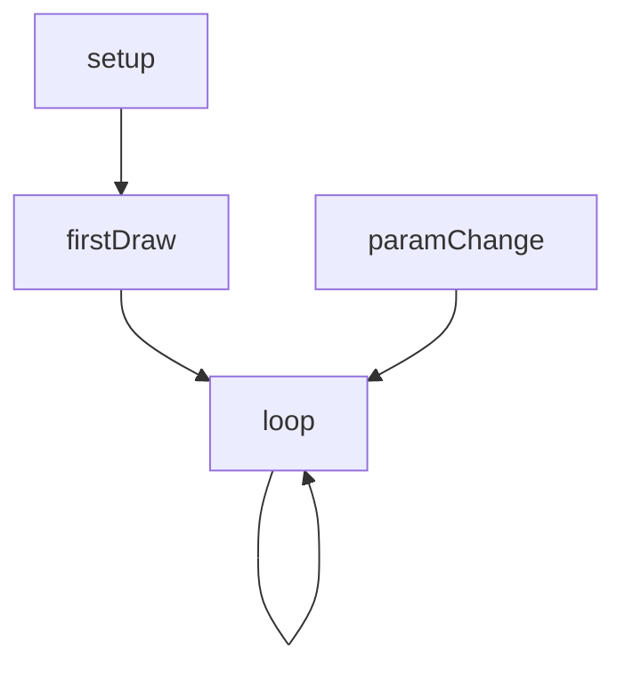
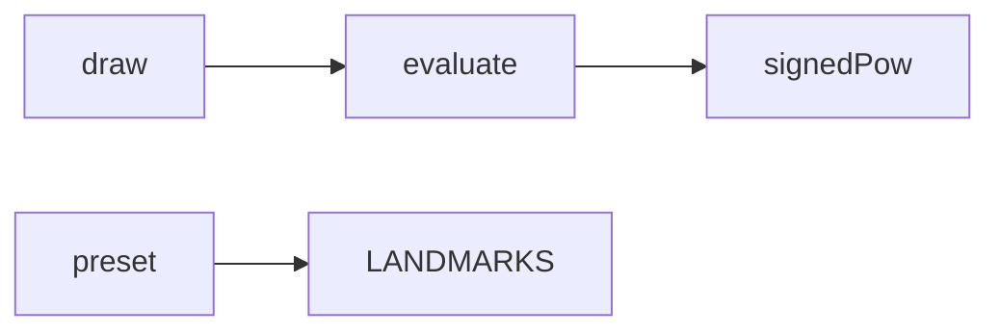
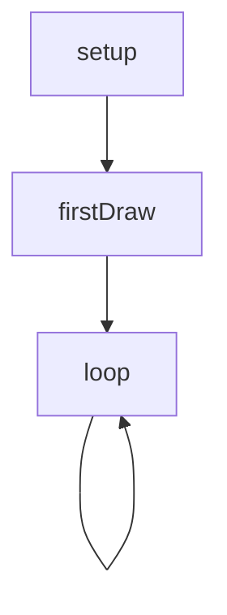
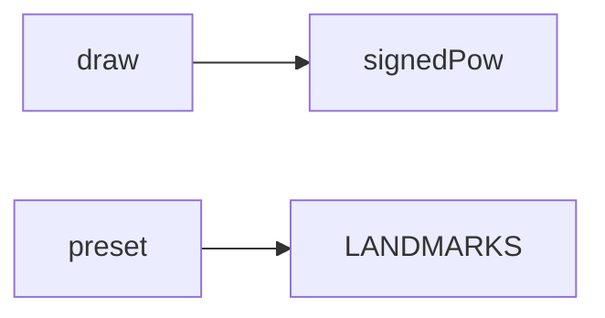

# lissajous — System Map

## Reference (v4 — 2026-04-23)

**Source:** `reference/generators/lissajous/source/lissajous.gen.js` (305 lines)  
**Mode:** canvas2d  
**Coverage:** 9 functions mapped, 0 not-relevant

### Lifecycle

### Function Call Graph

### Data Pathways

| pathway_id | input | transform chain | output | per-frame? | parallelisable? |
|---|---|---|---|---|---|
| P-01 | params + LANDMARKS values | evaluate equation terms + rotation | sampled coordinates | yes | yes (per-particle) |
| P-02 | sampled coordinates | canvas path accumulation + stroke | canvas pixels | yes | partial (per-row) |
| P-03 | X-axis params + delta Y settings | delta resolver | effective Y params | yes | no (sequential state) |

### State Inventory

| name | scope | type | purpose | initialised by | mutated by |
|---|---|---|---|---|---|
| LANDMARKS | module-const | Array<object> | preset catalogue | top-level | (immutable) |
| runtimeParams | closure | object | effective draw params | draw | draw |

## Live (v4 — 2026-04-23)

**Source:** `assets/js/tools/generators/scripts/parametric/lissajous.gen.js` (340 lines)  
**Mode:** canvas2d  
**Coverage:** 8 functions mapped, 0 not-relevant

### Lifecycle

### Function Call Graph

### Data Pathways

| pathway_id | input | transform chain | output | per-frame? | parallelisable? |
|---|---|---|---|---|---|
| P-01 | params + LANDMARKS values | inlined equation terms + rotation | sampled coordinates | yes | yes (per-particle) |
| P-02 | sampled coordinates | path build + path-break guard + stroke | canvas pixels | yes | partial (per-row) |
| P-03 | host animatable params | host parametric interpolation | animated params | yes | n/a |

### State Inventory

| name | scope | type | purpose | initialised by | mutated by |
|---|---|---|---|---|---|
| LANDMARKS | module-const | Array<object> | preset catalogue | top-level | (immutable) |
| SCRIPT_CONFIG.animatableParams | module-const | Array<object> | host animation map | top-level | (immutable) |

## Architectural Divergence Notes

- Live removes reference delta-coupled Y parameter resolution; Y controls are absolute and independent from X.
- Live inlines `evaluate()` math into `draw()`, eliminating call overhead and object allocation in the hot loop.
- Live adds path-break clipping guard for extreme off-screen coordinates from negative-power parameter combinations.
