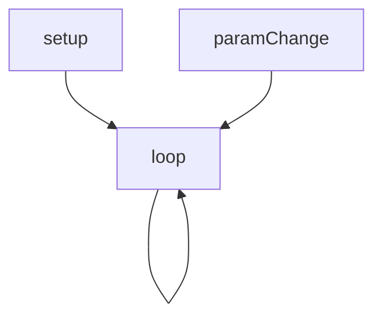
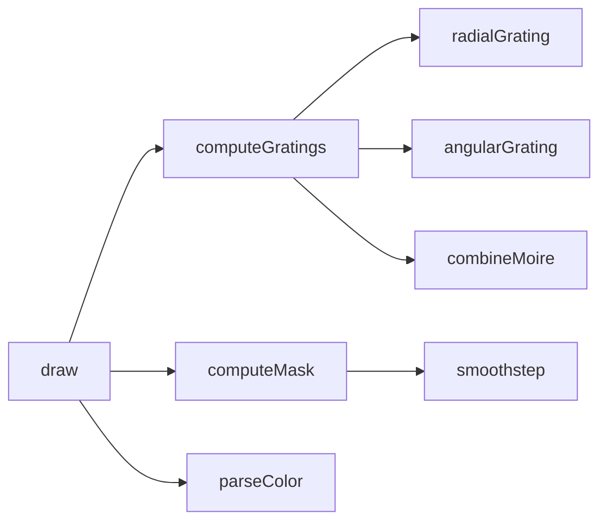

# moire — System Map

## Reference (v4 — 2026-04-23)

**Source:** `reference/generators/moire/source/moire.gen.js` (514 lines)  
**Mode:** canvas2d  
**Coverage:** 10 functions mapped, 0 not-relevant

### Lifecycle

### Function Call Graph

### Data Pathways

| pathway_id | input | transform chain | output | per-frame? | parallelisable? |
|---|---|---|---|---|---|
| P-01 | params + frame | phase/centre derivation | effective field params | yes | no (sequential state) |
| P-02 | pixel coords + field params | gratings + mask + threshold | binary on/off map | yes | yes (per-pixel) |
| P-03 | binary map + colours | RGB write to ImageData + putImageData | canvas pixels | yes | partial (per-row) |

### State Inventory

| name | scope | type | purpose | initialised by | mutated by |
|---|---|---|---|---|---|
| TWO_PI | module-const | number | trig constant | top-level | (immutable) |

## Live (v4 — 2026-04-23)

**Source:** `assets/js/tools/generators/scripts/wave/moire.gen.js` (527 lines)  
**Mode:** canvas2d  
**Coverage:** 10 functions mapped, 0 not-relevant

### Lifecycle

### Function Call Graph

### Data Pathways

| pathway_id | input | transform chain | output | per-frame? | parallelisable? |
|---|---|---|---|---|---|
| P-01 | params + frame | phase/centre derivation | effective field params | yes | no (sequential state) |
| P-02 | pixel coords + field params | gratings + mask + threshold | binary on/off map | yes | yes (per-pixel) |
| P-03 | binary map + colours | RGB write to ImageData + putImageData | canvas pixels | yes | partial (per-row) |

### State Inventory

| name | scope | type | purpose | initialised by | mutated by |
|---|---|---|---|---|---|
| TWO_PI | module-const | number | trig constant | top-level | (immutable) |
| SCRIPT_CONFIG.animation.animatableParams | module-const | Array<string> | host animation mapping | top-level | (immutable) |

## Architectural Divergence Notes

- Live normalises control types for key selectors (`combineMode`, `maskType`, `invert`) and removes inert canvas parameters.
- Live adds `animation.animatableParams` for host sequencer integration.
- Render hook remains external function reference (`draw: draw`) instead of inline method contract.
