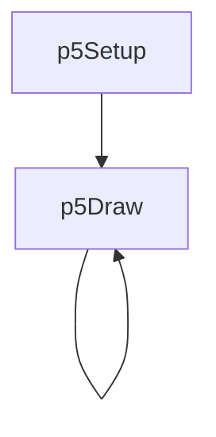
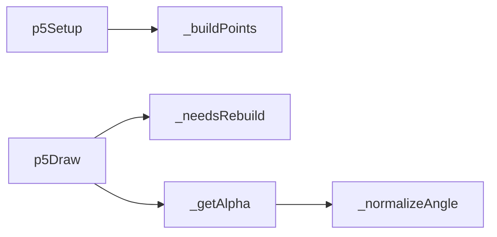
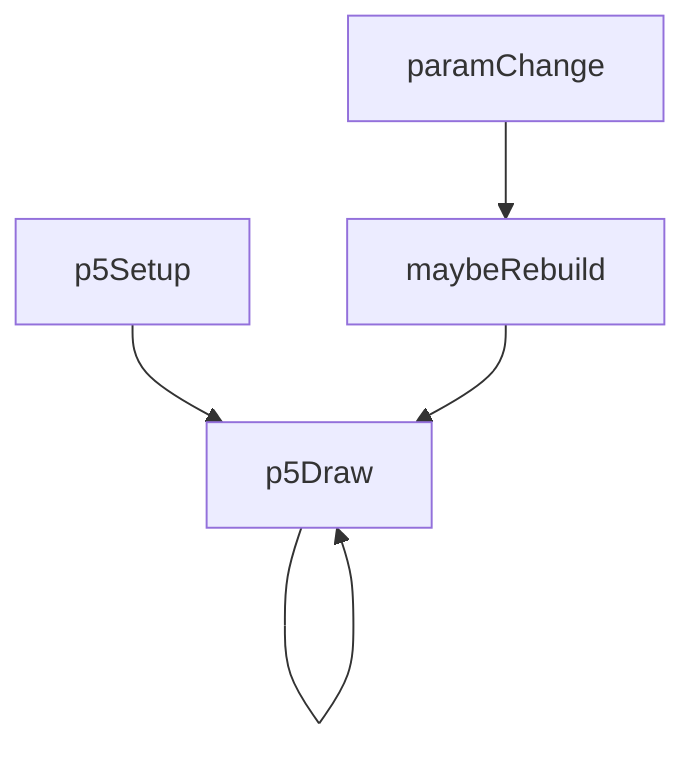

# order-disorder — System Map

## Reference (v4 — 2026-04-23)

**Source:** `reference/generators/order-disorder/source/order-disorder.gen.js` (210 lines)  
**Mode:** p5 point field  
**Coverage:** 6 units mapped, 0 not-relevant

### Lifecycle

### Function Call Graph

### Data Pathways

| pathway_id | input | transform chain | output | per-frame? | parallelisable? |
|---|---|---|---|---|---|
| P-01 | grid params | point grid builder | point metadata array | on rebuild | no (sequential state) |
| P-02 | frame + influence params | alpha field evaluation | per-point alpha | yes | yes (per-point) |
| P-03 | alpha + noise params | noisy displacement + jiggle | rendered point positions | yes | yes (per-point) |

### State Inventory

| name | scope | type | purpose | initialised by | mutated by |
|---|---|---|---|---|---|
| _points | SCRIPT_CONFIG | Array<object> | point metadata cache | p5Setup | rebuild logic |
| _lastParams | SCRIPT_CONFIG | object | rebuild guard params | p5Setup | rebuild logic |

## Live (v4 — 2026-04-23)

**Source:** `assets/js/tools/generators/scripts/pattern/order-disorder.gen.js` (262 lines)  
**Mode:** p5 point field  
**Coverage:** 7 units mapped, 0 not-relevant

### Lifecycle

### Function Call Graph

### Data Pathways

| pathway_id | input | transform chain | output | per-frame? | parallelisable? |
|---|---|---|---|---|---|
| P-01 | grid params + canvas dimensions | point grid builder | point metadata array | on rebuild | no (sequential state) |
| P-02 | frame + influence params | alpha field evaluation | per-point alpha | yes | yes (per-point) |
| P-03 | alpha + noise params | noisy displacement + jiggle + POINTS batching | rendered point positions | yes | yes (per-point) |

### State Inventory

| name | scope | type | purpose | initialised by | mutated by |
|---|---|---|---|---|---|
| _points | SCRIPT_CONFIG | Array<object> | point metadata cache | p5Setup | rebuild logic |
| _lastParams | SCRIPT_CONFIG | object | rebuild guard params | p5Setup | rebuild logic |

## Architectural Divergence Notes

- Live shifts animation contract from loop to infinite to match non-looping noise-time behaviour.
- Live removes hardcoded canvas dimensions from point builder and center calculations.
- Live batches point drawing through `beginShape(POINTS)`/`vertex()` to reduce per-point draw-call overhead.
