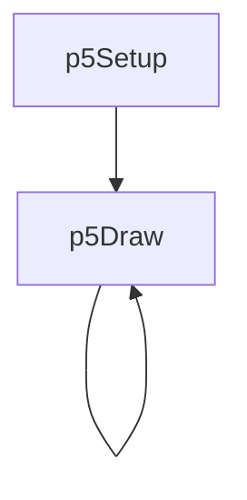
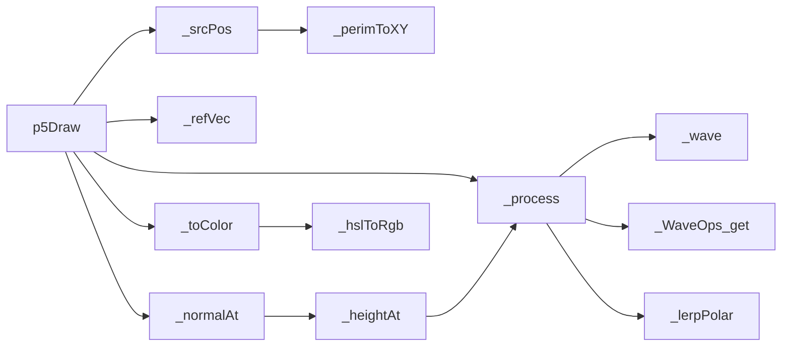
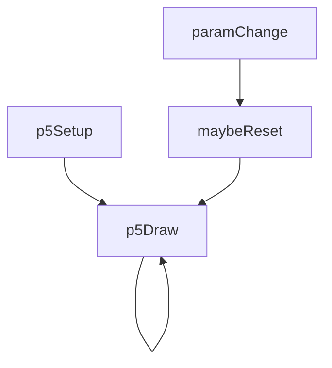
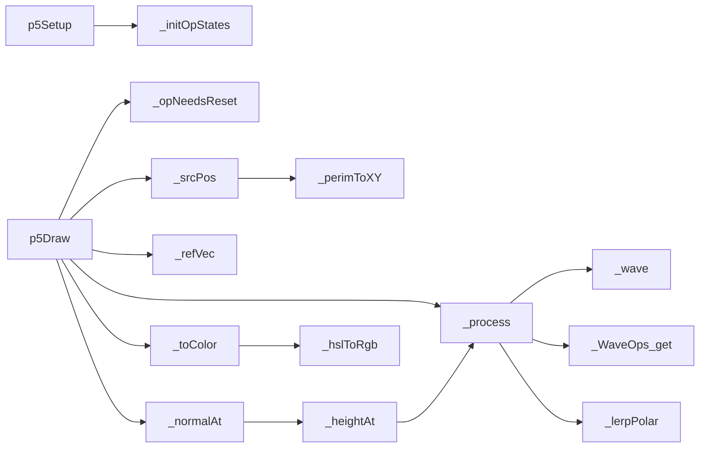

# p5-wave-colour — System Map

## Reference (v4 — 2026-04-23)

**Source:** `reference/generators/p5-wave-colour/source/p5-wave-colour.gen.js` (314 lines)  
**Mode:** p5 pixel buffer  
**Coverage:** 9 functions mapped, 0 not-relevant

### Lifecycle

### Function Call Graph

### Data Pathways

| pathway_id | input | transform chain | output | per-frame? | parallelisable? |
|---|---|---|---|---|---|
| P-01 | frame + source-loop params | perimeter orbit solver | 4 source positions | yes | no (sequential state) |
| P-02 | pixel coords + sources | complex wave composition pipeline | complex state | yes | yes (per-pixel) |
| P-03 | complex state + reference vector | normal estimate + HSL mapping | RGB colour | yes | yes (per-pixel) |
| P-04 | RGB + resolution blocks | block-fill writes | p5 pixel buffer | yes | partial (per-row) |

### State Inventory

| name | scope | type | purpose | initialised by | mutated by |
|---|---|---|---|---|---|
| _opStates | SCRIPT_CONFIG | Array<object> | operator transition state | _initOpStates | p5Draw |
| _lastOpSpeeds | SCRIPT_CONFIG | Array<number> | reset detection cache | _initOpStates | _initOpStates |
| _TRIANGLE | SCRIPT_CONFIG const | Array<object> | reference-vector path | top-level | (immutable) |

## Live (v4 — 2026-04-23)

**Source:** `assets/js/tools/generators/scripts/wave/p5-wave-colour.gen.js` (400 lines)  
**Mode:** p5 pixel buffer  
**Coverage:** 10 functions mapped, 0 not-relevant

### Lifecycle

### Function Call Graph

### Data Pathways

| pathway_id | input | transform chain | output | per-frame? | parallelisable? |
|---|---|---|---|---|---|
| P-01 | frame + source-loop params | perimeter orbit solver | 4 source positions | yes | no (sequential state) |
| P-02 | pixel coords + sources | deterministic complex-op pipeline | complex state | yes | yes (per-pixel) |
| P-03 | complex state + reference vector | forward-diff normal + HSL mapping | RGB colour | yes | yes (per-pixel) |
| P-04 | RGB + resolution blocks | block-fill writes | p5 pixel buffer | yes | partial (per-row) |
| P-05 | op-speed params | reset detector + state initialiser | refreshed operator state | on change | no (sequential state) |

### State Inventory

| name | scope | type | purpose | initialised by | mutated by |
|---|---|---|---|---|---|
| _opStates | SCRIPT_CONFIG | Array<object> | operator transition state | _initOpStates | p5Draw |
| _lastOpSpeeds | SCRIPT_CONFIG | Array<number> | reset detection cache | _initOpStates | _initOpStates |
| _TRIANGLE | SCRIPT_CONFIG const | Array<object> | reference-vector path | top-level | (immutable) |

## Architectural Divergence Notes

- Live replaces stochastic operator transitions with deterministic seeded selection to guarantee reproducibility.
- Live synchronises `animation.loopFrames` with `cycleFrames` in `p5Setup`, resolving loop-length mismatch.
- Live optimises normal estimation by reusing centre height (fewer `_process` calls per sample).
