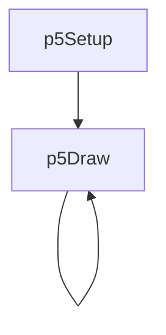
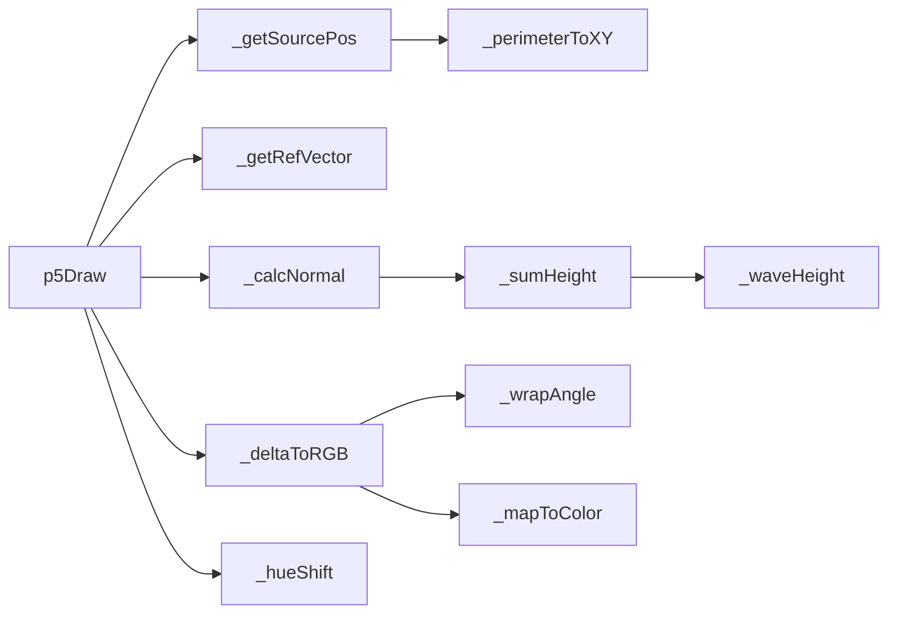

# p5-wave-interference — System Map

## Reference (v4 — 2026-04-23)

**Source:** `reference/generators/p5-wave-interference/source/p5-wave-interference.gen.js` (242 lines)  
**Mode:** p5 pixel buffer  
**Coverage:** 9 functions mapped, 0 not-relevant

### Lifecycle

### Function Call Graph

### Data Pathways

| pathway_id | input | transform chain | output | per-frame? | parallelisable? |
|---|---|---|---|---|---|
| P-01 | frame + loop params | perimeter orbit solver | 4 source positions | yes | no (sequential state) |
| P-02 | source positions + pixel coords | wave sum + normal estimation | pair normals | yes | yes (per-pixel) |
| P-03 | normals + ref vector | angular deltas + hue shift | RGB pixel colour | yes | yes (per-pixel) |
| P-04 | RGB + resolution blocks | pixel replication write | p5 pixel buffer | yes | partial (per-row) |

### State Inventory

| name | scope | type | purpose | initialised by | mutated by |
|---|---|---|---|---|---|
| _triangle | SCRIPT_CONFIG const | Array<object> | reference-vector triangle path | top-level | (immutable) |
| _perimeter | SCRIPT_CONFIG const | number | fixed perimeter (1080x1080) | top-level | (immutable) |

## Live (v4 — 2026-04-23)

**Source:** `assets/js/tools/generators/scripts/wave/p5-wave-interference.gen.js` (295 lines)  
**Mode:** p5 pixel buffer  
**Coverage:** 10 functions mapped, 0 not-relevant

### Lifecycle

### Function Call Graph

### Data Pathways

| pathway_id | input | transform chain | output | per-frame? | parallelisable? |
|---|---|---|---|---|---|
| P-01 | frame + loop params + W/H | dynamic perimeter orbit solver | 4 source positions | yes | no (sequential state) |
| P-02 | source positions + pixel coords | wave sum + normal estimation | pair normals | yes | yes (per-pixel) |
| P-03 | normals + cached ref atan values | angular deltas + hue shift | RGB pixel colour | yes | yes (per-pixel) |
| P-04 | RGB + resolution blocks | pixel replication write | p5 pixel buffer | yes | partial (per-row) |

### State Inventory

| name | scope | type | purpose | initialised by | mutated by |
|---|---|---|---|---|---|
| _triangle | SCRIPT_CONFIG const | Array<object> | reference-vector triangle path | top-level | (immutable) |
| animation.loopFrames | SCRIPT_CONFIG const | number | fixed cycle period | top-level | (immutable) |

## Architectural Divergence Notes

- Live removes `cycleFrames` parameter and uses fixed `animation.loopFrames` to eliminate cycle-period conflicts.
- Live adopts standard preset format (`{name, values}`) and adds animation metadata (`animatableParams`, `sequencer`).
- Live computes perimeter from runtime canvas dimensions instead of fixed 1080 perimeter constant.
