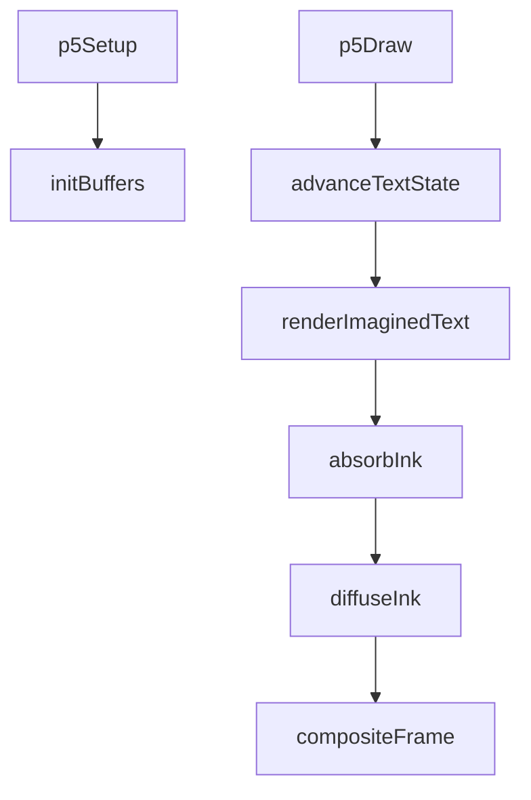
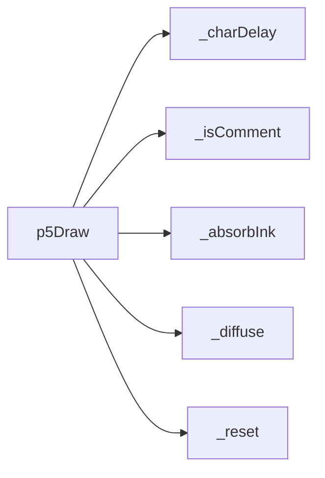
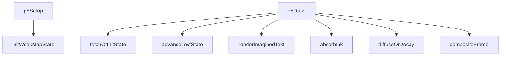
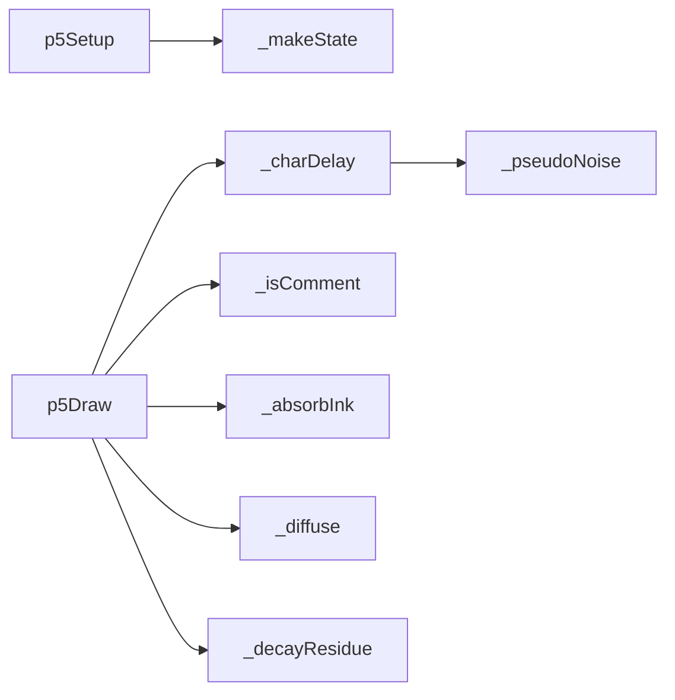

# quine — System Map

## Reference (v4 — 2026-04-23)

**Source:** `reference/generators/quine/source/quine.gen.js` (330 lines)  
**Mode:** p5 typed-text ink diffusion simulation  
**Coverage:** 7 units mapped, 0 not-relevant

### Lifecycle

### Function Call Graph

### Data Pathways

| pathway_id | input | transform chain | output | per-frame? | parallelisable? |
|---|---|---|---|---|---|
| P-01 | `frame` + typing params + source text | character delay/state-machine transitions | visible typed text state | yes | no |
| P-02 | imagined text pixels + ink params | absorb + bidirectional diffusion on residue buffers | wet ink residue field | yes | yes (per-pixel) |
| P-03 | imagined text + residue + paper colours | branch composite (sharp ink vs bleed halo vs paper) | final canvas frame | yes | yes (per-pixel) |

### State Inventory

| name | scope | type | purpose | initialised by | mutated by |
|---|---|---|---|---|---|
| `_past/_present/_charIndex` | SCRIPT_CONFIG | mixed | typing progress state | `_reset` | p5Draw |
| `_dormant/_clearing/_blankLines` | SCRIPT_CONFIG | flags/counters | cycle phase machine | `_reset` | p5Draw |
| `_residue/_echo/_reflection` | SCRIPT_CONFIG | Float32Array | ink simulation buffers | `_reset` | `_absorbInk`/`_diffuse` |
| `_imagined` | SCRIPT_CONFIG | p5.Graphics | offscreen text render buffer | p5Setup | p5Draw |
| `_nextFrame` | SCRIPT_CONFIG | number | next character emission frame | `_reset` | p5Draw |

## Live (v4 — 2026-04-23)

**Source:** `assets/js/tools/generators/scripts/other/quine.gen.js` (443 lines)  
**Mode:** p5 typed-text ink diffusion simulation  
**Coverage:** same core flow with state isolation and dirty-region optimisation

### Lifecycle

### Function Call Graph

### Data Pathways

| pathway_id | input | transform chain | output | per-frame? | parallelisable? |
|---|---|---|---|---|---|
| P-01 | `frame` + typing params + source text | deterministic char-index delay + state-machine transitions | visible typed text state | yes | no |
| P-02 | imagined text pixels + ink params + active bounds | absorb + dirty-region diffusion/decay on residue buffers | wet ink residue field | yes | yes (per-pixel in active region) |
| P-03 | imagined text + residue + paper colours | branch composite (sharp ink vs bleed halo vs paper) | final canvas frame | yes | yes (per-pixel) |

### State Inventory

| name | scope | type | purpose | initialised by | mutated by |
|---|---|---|---|---|---|
| `_instances` | module | WeakMap<p5,state> | per-instance state isolation | module init | p5Setup/p5Draw |
| `state.past/present/charIndex` | per-instance | mixed | typing progress state | `_makeState` | p5Draw |
| `state.dormant/clearing/blankLines` | per-instance | flags/counters | cycle phase machine | `_makeState` | p5Draw |
| `state.residue/state.echo` | per-instance | Float32Array | ink simulation buffers | `_makeState` | `_absorbInk`/`_diffuse` |
| `state.activeX0..activeY1` | per-instance | bounds | dirty-region clipping window | `_makeState` | `_absorbInk`/`_diffuse`/`_decayResidue` |
| `state.passDir` | per-instance | number | alternating diffusion sweep direction | `_makeState` | `_diffuse` |

## Architectural Divergence Notes

- Core behaviour remains aligned with reference semantics (typed text, bleed diffusion, cyclic reset).
- Live introduces deterministic delay hashing, per-instance `WeakMap` state, dirty-region diffusion bounds, and expanded host metadata.
- Documentation remains partially stale and still describes pre-fix behaviours in some files.
