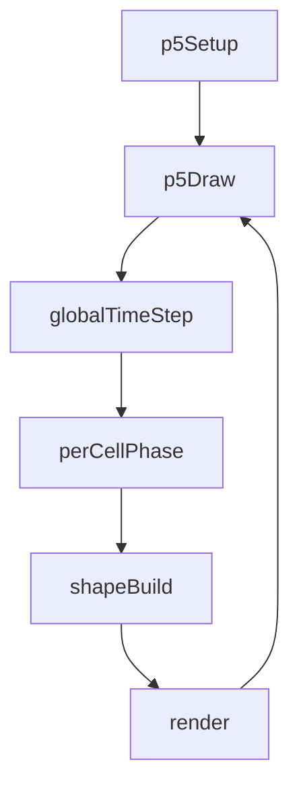
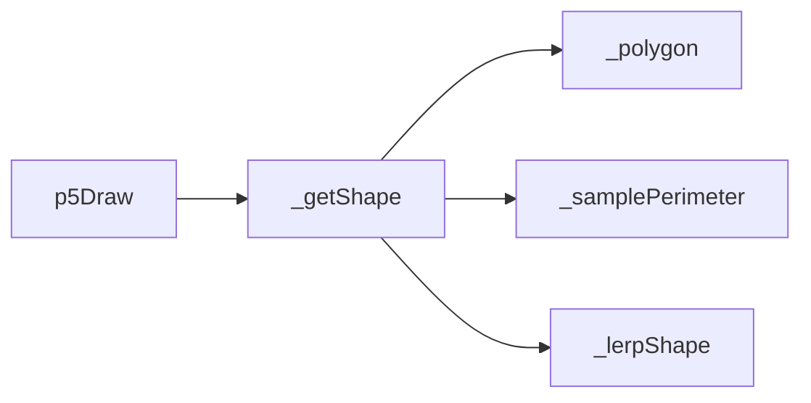
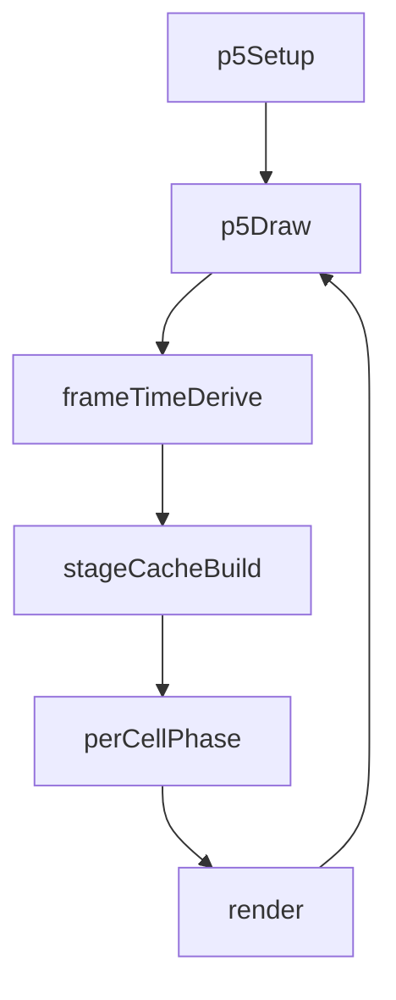
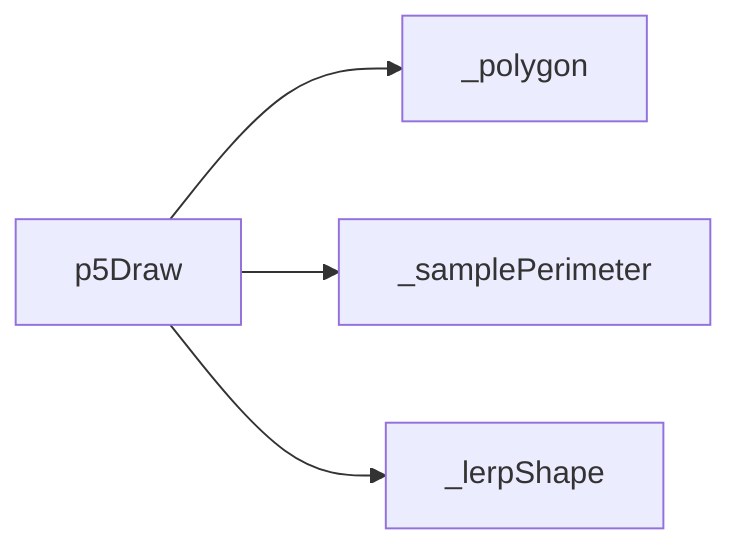

# shape-array — System Map

## Reference (v4 — 2026-04-23)

**Source:** `reference/generators/shape-array/source/shape-array.gen.js` (166 lines)  
**Mode:** p5 grid morph  
**Coverage:** 6 units mapped, 0 not-relevant

### Lifecycle

### Function Call Graph

### Data Pathways

| pathway_id | input | transform chain | output | per-frame? | parallelisable? |
|---|---|---|---|---|---|
| P-01 | frame + morphSpeed | global phase update | base morph phase | yes | no |
| P-02 | base phase + cell indices | phase-offset mapping + shape interpolation | per-cell vertex arrays | yes | yes (per-cell) |
| P-03 | grid metrics + vertex arrays | translation + stroke render | full grid frame | yes | partial |

### State Inventory

| name | scope | type | purpose | initialised by | mutated by |
|---|---|---|---|---|---|
| _globalT | SCRIPT_CONFIG | number | accumulated morph phase | p5Setup | p5Draw |

## Live (v4 — 2026-04-23)

**Source:** `assets/js/tools/generators/scripts/pattern/shape-array.gen.js` (227 lines)  
**Mode:** p5 grid morph + stage cache  
**Coverage:** 7 units mapped, 0 not-relevant

### Lifecycle

### Function Call Graph

### Data Pathways

| pathway_id | input | transform chain | output | per-frame? | parallelisable? |
|---|---|---|---|---|---|
| P-01 | frame + morphSpeed | deterministic global phase derivation | base morph phase | yes | no |
| P-02 | stage index | cached perimeter samples | stage pair geometry | yes | no (small cached set) |
| P-03 | base phase + cell indices + stage cache | per-cell interpolation + draw | full grid frame | yes | yes (per-cell) |

### State Inventory

| name | scope | type | purpose | initialised by | mutated by |
|---|---|---|---|---|---|
| stageCache | p5Draw local | Map<number,object> | per-frame sample reuse | p5Draw | p5Draw |

## Architectural Divergence Notes

- Live replaces mutable `_globalT` state with deterministic frame-derived phase.
- Live adds per-frame stage sample caching to reduce redundant perimeter sampling across cells.
- Live retains core reference behaviour while adding standards metadata (export/animation/info sections).
