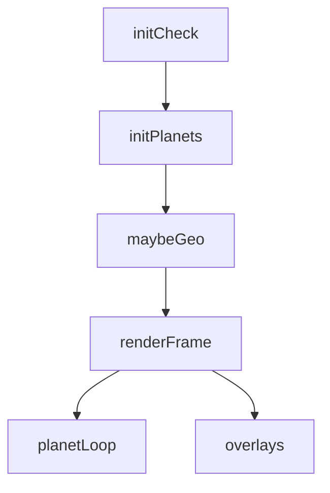
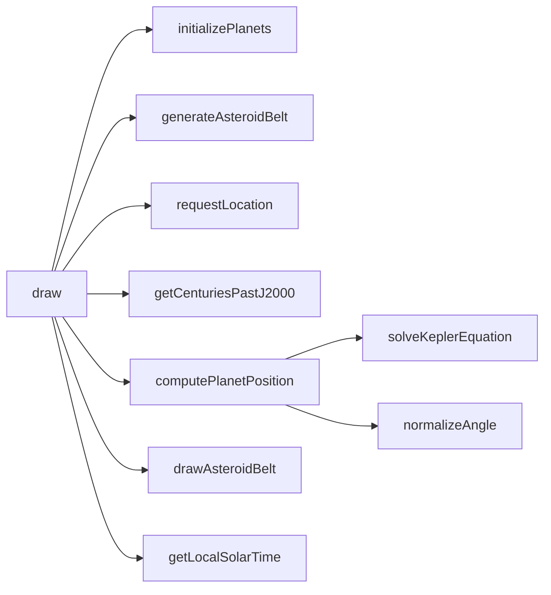
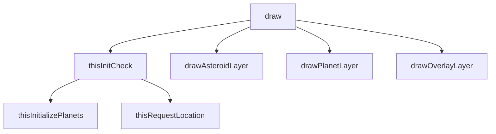
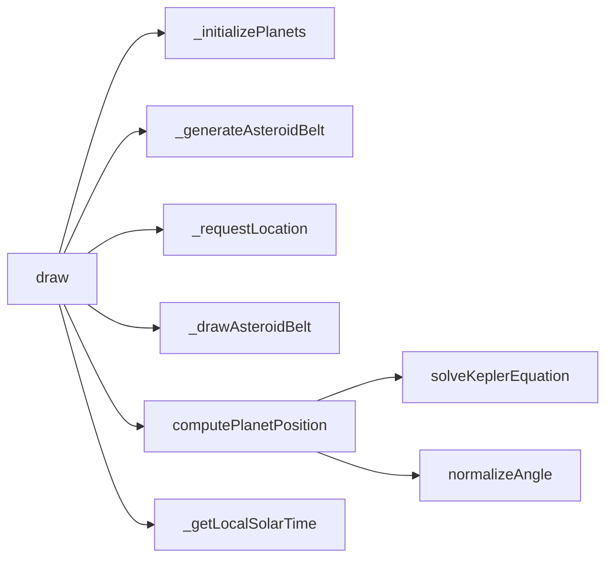

# solar-system — System Map

## Reference (v4 — 2026-04-23)

**Source:** `reference/generators/solar-system/source/solar-system.gen.js` (544 lines)  
**Mode:** realtime astronomical display  
**Coverage:** 12 units mapped, 0 not-relevant

### Lifecycle

### Function Call Graph

### Data Pathways

| pathway_id | input | transform chain | output | per-frame? | parallelisable? |
|---|---|---|---|---|---|
| P-01 | wall-clock time | Julian-centuries conversion + Kepler solve | planet heliocentric positions | yes | yes (per-planet) |
| P-02 | asteroid config | random belt generation + cached projection | asteroid dot field | on count change + draw | yes (per-particle) |
| P-03 | geolocation + Earth orbit | local solar time + viewer vector + FOV math | viewer dot and cone overlay | yes | no |

### State Inventory

| name | scope | type | purpose | initialised by | mutated by |
|---|---|---|---|---|---|
| planets | module | array | planet instances + cache | initializePlanets | draw/update loop |
| asteroidParticles | module | array | belt particle source | generateAsteroidBelt | regenerate on count change |
| asteroidCached | module | array/null | projected asteroid cache | drawAsteroidBelt | invalidated on regen |
| longitude/latitude | module | number/null | geolocation result | requestLocation | fetch callback |
| locationRequested | module | boolean | one-shot request guard | module init | requestLocation |

## Live (v4 — 2026-04-23)

**Source:** `assets/js/tools/generators/scripts/other/solar-system.gen.js` (429 lines)  
**Mode:** realtime astronomical display  
**Coverage:** equivalent pipeline with architecture cleanup

### Lifecycle

### Function Call Graph

### Data Pathways

| pathway_id | input | transform chain | output | per-frame? | parallelisable? |
|---|---|---|---|---|---|
| P-01 | wall-clock time | Julian-centuries conversion + Kepler solve | planet heliocentric positions | yes | yes (per-planet) |
| P-02 | asteroid config | normalised cache -> screen cache -> ImageData blit | asteroid dot field | on count/spatial change + draw | yes (per-particle) |
| P-03 | geolocation + Earth orbit | local solar time + viewer vector + FOV math | viewer dot and cone overlay | yes | no |

### State Inventory

| name | scope | type | purpose | initialised by | mutated by |
|---|---|---|---|---|---|
| `_planets` | SCRIPT_CONFIG | array | planet instances + cache | `_initializePlanets` | draw/update loop |
| `_asteroidParticles` | SCRIPT_CONFIG | array | belt particle source | `_generateAsteroidBelt` | regenerate on count change |
| `_asteroidCached` | SCRIPT_CONFIG | array/null | normalised belt cache | `_drawAsteroidBelt` | invalidated on regen |
| `_beltScreenCache` | SCRIPT_CONFIG | array/null | absolute screen cache | `_drawAsteroidBelt` | invalidated on spatial change |
| `_longitude/_latitude` | SCRIPT_CONFIG | number/null | geolocation result | `_requestLocation` | fetch callback |
| `_locationRequested` | SCRIPT_CONFIG | boolean | one-shot request guard | init | `_requestLocation` |

## Architectural Divergence Notes

- Core orbital mechanics and overlay behaviour remain equivalent to reference.
- Live removes module-level mutable state by storing runtime state on SCRIPT_CONFIG instance fields.
- Live removes inert canvas size params and switches asteroid draw path to a cached ImageData batch render.
