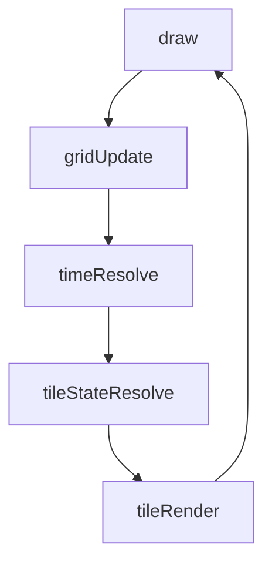
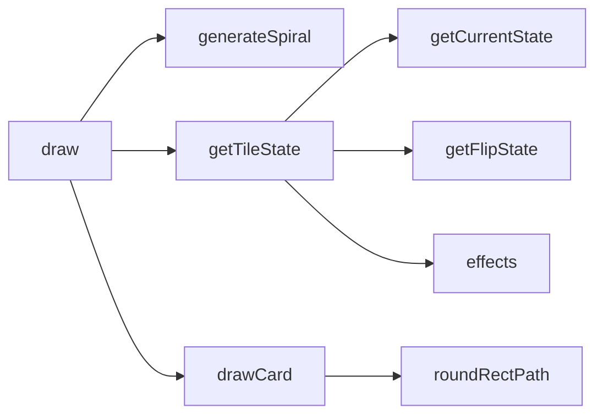
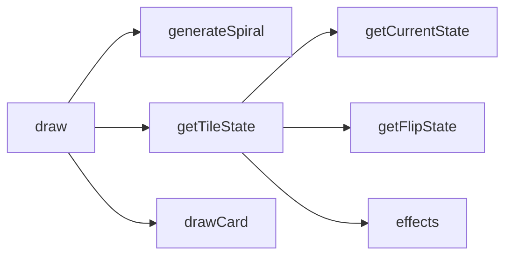

# squares — System Map

## Reference (v4 — 2026-04-23)

**Source:** `reference/generators/squares/source/squares.gen.js` (547 lines)  
**Mode:** timeline-driven tile illusion  
**Coverage:** 12 units mapped, 0 not-relevant

### Lifecycle

### Function Call Graph

### Data Pathways

| pathway_id | input | transform chain | output | per-frame? | parallelisable? |
|---|---|---|---|---|---|
| P-01 | frame + speed | timeline phase resolution | active phase state | yes | no |
| P-02 | tile coords + phase | pattern/transition/effect composition | per-tile transform/colour state | yes | yes (per-tile) |
| P-03 | tile state + grid geometry | card drawing path | rasterised frame | yes | yes (draw-order constrained by canvas state) |

### State Inventory

| name | scope | type | purpose | initialised by | mutated by |
|---|---|---|---|---|---|
| GRID | module | number | active grid dimension | module init | draw on param change |
| spiralPath | module | Array<[number,number]> | spiral order for transition | module init | draw on grid change |
| time | module | number | unused legacy state holder | module init | not mutated |

## Live (v4 — 2026-04-23)

**Source:** `assets/js/tools/generators/scripts/other/squares.gen.js` (548 lines)  
**Mode:** timeline-driven tile illusion  
**Coverage:** same as reference

### Lifecycle

### Function Call Graph

### Data Pathways

| pathway_id | input | transform chain | output | per-frame? | parallelisable? |
|---|---|---|---|---|---|
| P-01 | frame + speed | timeline phase resolution | active phase state | yes | no |
| P-02 | tile coords + phase | pattern/transition/effect composition | per-tile transform/colour state | yes | yes (per-tile) |
| P-03 | tile state + grid geometry | card drawing path | rasterised frame | yes | yes (draw-order constrained by canvas state) |

### State Inventory

| name | scope | type | purpose | initialised by | mutated by |
|---|---|---|---|---|---|
| GRID | module | number | active grid dimension | module init | draw on param change |
| spiralPath | module | Array<[number,number]> | spiral order for transition | module init | draw on grid change |
| time | module | number | unused legacy state holder | module init | not mutated |

## Architectural Divergence Notes

- Live and reference are structurally equivalent for algorithm flow and timeline choreography.
- Both retain module-level mutable state and inlined algorithmic libraries.
- `seek` and canvas dimension controls remain declared but operationally limited by host wiring.
