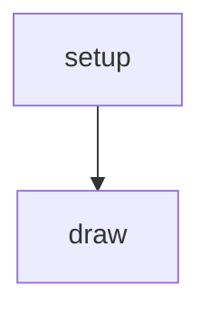
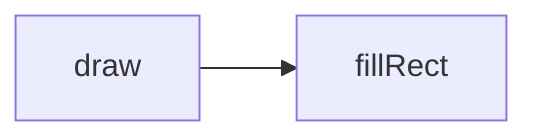
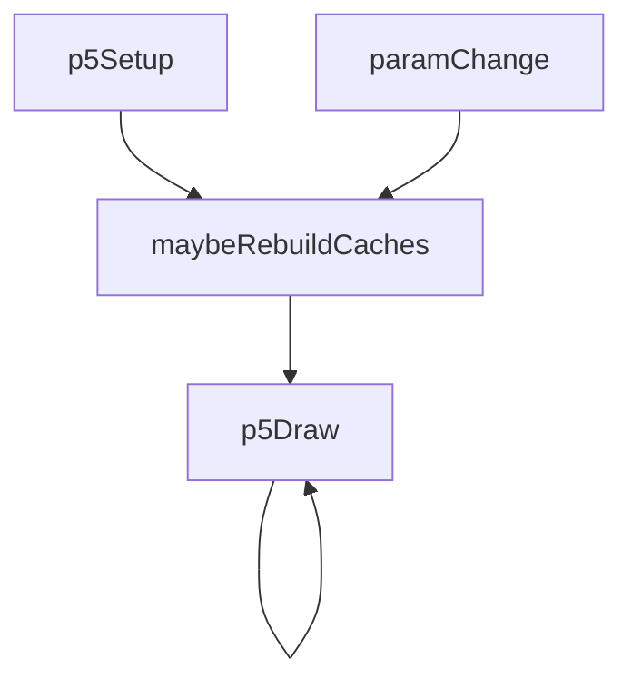
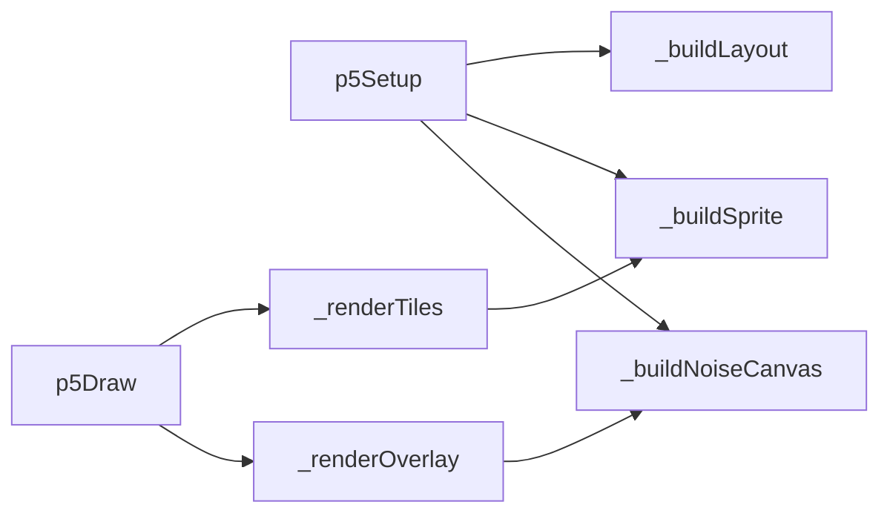

# tile-mosaic — System Map

## Reference (v4 — 2026-04-23)

**Source:** `reference/generators/tile-mosaic/source/tile-mosaic.gen.js` (21 lines)  
**Mode:** canvas2d  
**Coverage:** 3 units mapped, 0 not-relevant

### Lifecycle

### Function Call Graph

### Data Pathways

| pathway_id | input | transform chain | output | per-frame? | parallelisable? |
|---|---|---|---|---|---|
| P-01 | canvas + tileSize | black fill | black canvas | yes | n/a |

### State Inventory

| name | scope | type | purpose | initialised by | mutated by |
|---|---|---|---|---|---|
| (none) | — | — | no persistent state in reference stub | — | — |

## Live (v4 — 2026-04-23)

**Source:** `assets/js/tools/generators/scripts/pattern/tile-mosaic.gen.js` (562 lines)  
**Mode:** p5/canvas with offscreen sprites  
**Coverage:** 10 units mapped, 0 not-relevant

### Lifecycle

### Function Call Graph

### Data Pathways

| pathway_id | input | transform chain | output | per-frame? | parallelisable? |
|---|---|---|---|---|---|
| P-01 | layout params + seed | layout packer | tile rectangles/types | on rebuild | no (sequential state) |
| P-02 | tiles + style params | sprite cache generation | offscreen sprite atlas | on rebuild | partial (per-sprite) |
| P-03 | sprites + animation mode | tile blit + transforms | base mosaic frame | yes | partial (per-tile) |
| P-04 | overlay params + drift | noise/light overlay composite | final frame | yes | partial (per-pixel in overlay pass) |

### State Inventory

| name | scope | type | purpose | initialised by | mutated by |
|---|---|---|---|---|---|
| _spriteCache | SCRIPT_CONFIG | Map | cached tile sprites | setup/rebuild | style/layout change |
| _noiseCanvas | SCRIPT_CONFIG | OffscreenCanvas | overlay texture cache | setup/rebuild | seed/style change |
| _layoutA / _layoutB | SCRIPT_CONFIG | Array<object> | morph source/target layouts | setup/rebuild | rebuild |
| _driftOffset | SCRIPT_CONFIG | number | texture drift accumulator | setup | p5Draw |
| _lastLayoutKey / _lastStyleKey | SCRIPT_CONFIG | string | cache invalidation keys | setup | rebuild checks |

## Architectural Divergence Notes

- Reference is a placeholder stub; live is a full tile-system pipeline and is not source-parity comparable.
- Live introduces cache-heavy architecture (sprite/noise/layout caches) absent in reference.
- Live animation/export metadata and parameter surface are substantially richer than reference.
