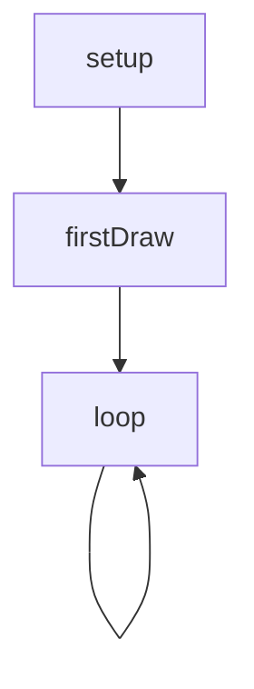
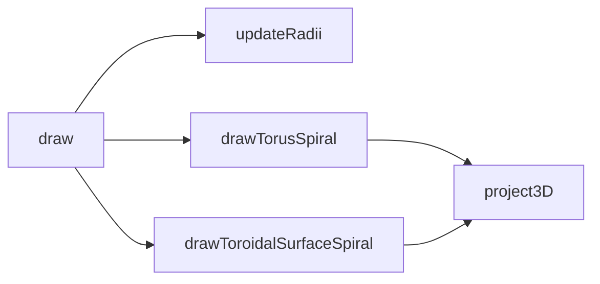
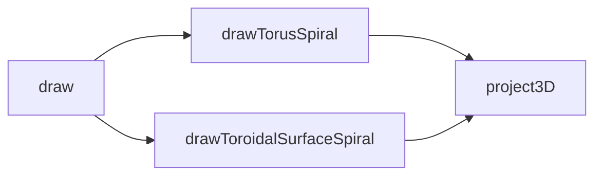

# torus — System Map

## Reference (v4 — 2026-04-23)

**Source:** `reference/generators/torus/source/torus.gen.js` (324 lines)  
**Mode:** canvas2d  
**Coverage:** 8 functions mapped, 0 not-relevant

### Lifecycle

### Function Call Graph

### Data Pathways

| pathway_id | input | transform chain | output | per-frame? | parallelisable? |
|---|---|---|---|---|---|
| P-01 | canvas size + torusSize | updateRadii | majorRadius/minorRadius state | yes | n/a |
| P-02 | frame + view params | rotation phase derivation | torus/spiral/x rotation angles | yes | no (sequential state) |
| P-03 | torus parametric points | project3D + canvas path draw | mesh + spiral pixels | yes | yes (per-particle) |

### State Inventory

| name | scope | type | purpose | initialised by | mutated by |
|---|---|---|---|---|---|
| majorRadius | module | number | torus major radius cache | top-level | updateRadii |
| minorRadius | module | number | torus minor radius cache | top-level | updateRadii |

## Live (v4 — 2026-04-23)

**Source:** `assets/js/tools/generators/scripts/parametric/torus.gen.js` (340 lines)  
**Mode:** canvas2d  
**Coverage:** 7 functions mapped, 0 not-relevant

### Lifecycle

### Function Call Graph

### Data Pathways

| pathway_id | input | transform chain | output | per-frame? | parallelisable? |
|---|---|---|---|---|---|
| P-01 | canvas size + torusSize | inline radii computation | R/r local values | yes | n/a |
| P-02 | frame + view params | phase + trig precompute | torus/spiral angles + trig cache | yes | no (sequential state) |
| P-03 | torus parametric points | project3D + canvas path draw | mesh + spiral pixels | yes | yes (per-particle) |

### State Inventory

| name | scope | type | purpose | initialised by | mutated by |
|---|---|---|---|---|---|
| SCRIPT_CONFIG.animation.loopFrames | module-const | number | host animation loop target | top-level | (immutable) |

## Architectural Divergence Notes

- Live removes module mutable radius state and computes radii locally per frame in `draw`.
- Live replaces reference projection with standardised Ry×Rx projection order.
- Live precomputes frame trig (`cosX`, `sinX`, `cosVY`, `sinVY`) once per frame and passes values through rendering helpers.
