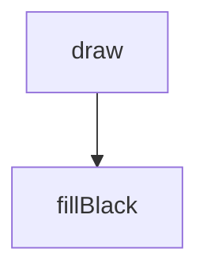
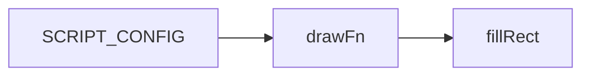
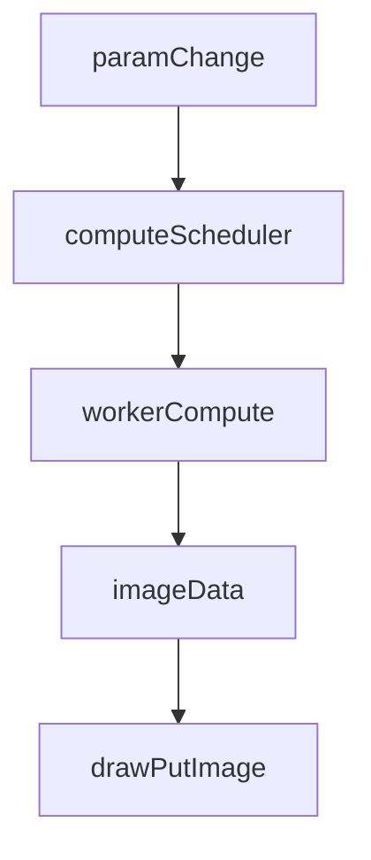
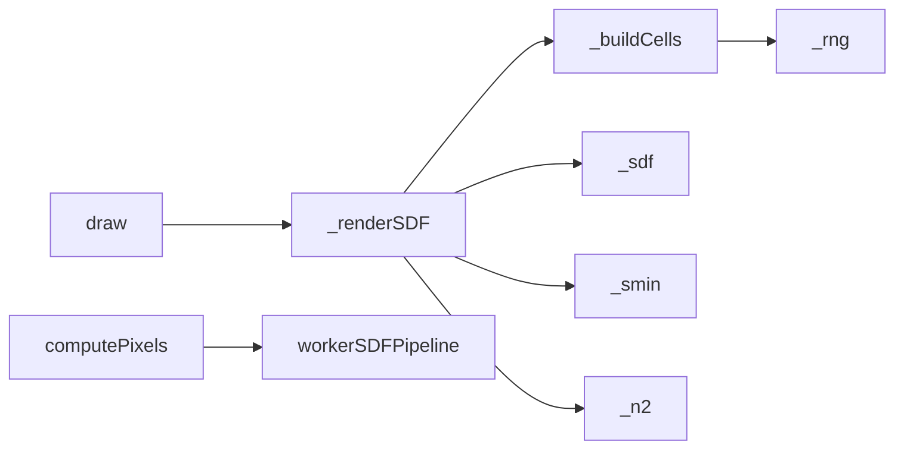

# unified-pattern — System Map

## Reference (v4 — 2026-04-23)

**Source:** `reference/generators/unified-pattern/source/unified-pattern.gen.js` (21 lines)  
**Mode:** placeholder stub  
**Coverage:** 1 unit mapped, 0 not-relevant

### Lifecycle

### Function Call Graph

### Data Pathways

| pathway_id | input | transform chain | output | per-frame? | parallelisable? |
|---|---|---|---|---|---|
| P-01 | canvas/context | set fill + clear rect | black frame | yes | no |

### State Inventory

| name | scope | type | purpose | initialised by | mutated by |
|---|---|---|---|---|---|
| scale | params | number | placeholder UI control | SCRIPT_CONFIG | host param changes |

## Live (v4 — 2026-04-23)

**Source:** `assets/js/tools/generators/scripts/other/unified-pattern.gen.js` (500 lines)  
**Mode:** static SDF pattern synthesis  
**Coverage:** high-complexity multi-stage pipeline

### Lifecycle

### Function Call Graph

### Data Pathways

| pathway_id | input | transform chain | output | per-frame? | parallelisable? |
|---|---|---|---|---|---|
| P-01 | params | jittered-grid cell synthesis | cell set with nested shape descriptors | on param change | yes (per-cell) |
| P-02 | pixels + params | domain warp + superellipse SDF + smooth union | signed field buffer | on param change | yes (per-pixel) |
| P-03 | field + palette | band mapping + raster write | final canvas image | on param change | yes (per-pixel) |

### State Inventory

| name | scope | type | purpose | initialised by | mutated by |
|---|---|---|---|---|---|
| palette/bg tables | module | constants | colour lookup | module init | immutable |
| helper functions | module | functions | noise/SDF/render helpers | module init | immutable |

## Architectural Divergence Notes

- Reference is a minimal stub with one inert parameter and black fill draw.
- Live is a full geometric SDF generator with worker compute, adaptive interaction scaling, presets, and static export metadata.
- This is a reference-source placeholder divergence; strict parity to stub is not meaningful without user override.
