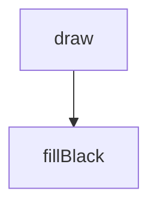
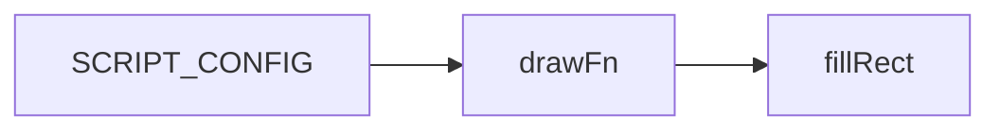
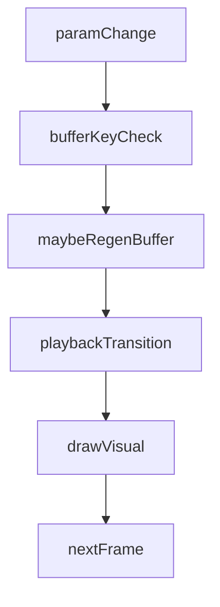
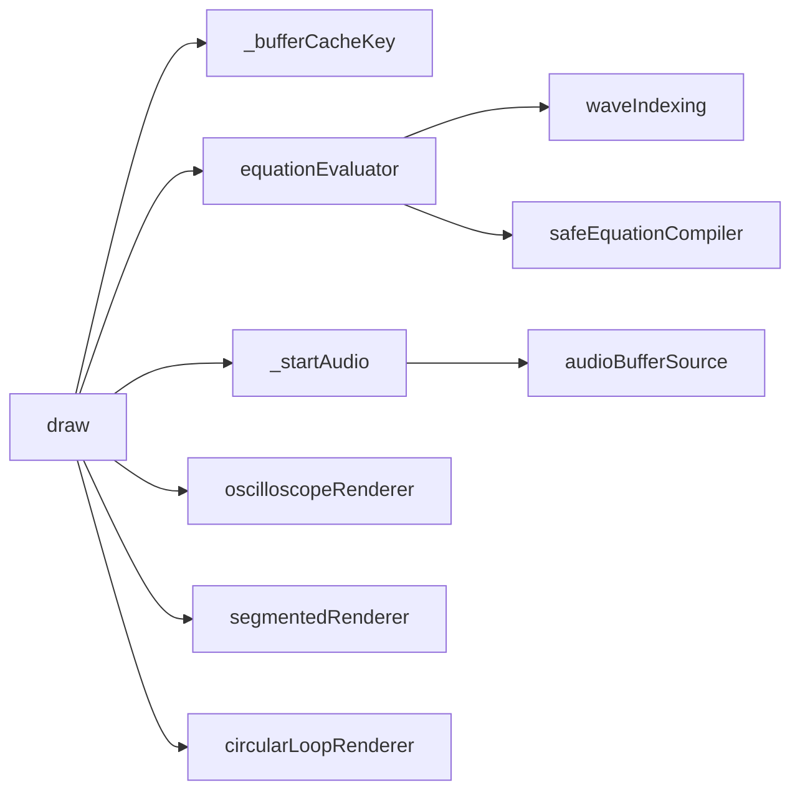

# wave-equation-synth — System Map

## Reference (v4 — 2026-04-23)

**Source:** `reference/generators/wave-equation-synth/source/wave-equation-synth.gen.js` (22 lines)  
**Mode:** placeholder stub  
**Coverage:** 1 unit mapped, 0 not-relevant

### Lifecycle

### Function Call Graph

### Data Pathways

| pathway_id | input | transform chain | output | per-frame? | parallelisable? |
|---|---|---|---|---|---|
| P-01 | canvas/context | set fill + clear rect | black frame | yes | no |

### State Inventory

| name | scope | type | purpose | initialised by | mutated by |
|---|---|---|---|---|---|
| harmonics | params | number | placeholder UI control | SCRIPT_CONFIG | host param changes |

## Live (v4 — 2026-04-23)

**Source:** `assets/js/tools/generators/scripts/other/wave-equation-synth.gen.js` (580 lines)  
**Mode:** audio synthesis + waveform visualisation  
**Coverage:** multi-stage audio/visual pipeline

### Lifecycle

### Function Call Graph

### Data Pathways

| pathway_id | input | transform chain | output | per-frame? | parallelisable? |
|---|---|---|---|---|---|
| P-01 | eq params + audio params | compile expressions + sample evaluation | Float32 synthesis buffer | on synthesis-param change | yes (per-sample) |
| P-02 | synthesis buffer + playback toggle | AudioBuffer wrap + source lifecycle + gain control | audible looped output | on play/toggle + volume updates | no |
| P-03 | synthesis buffer + visual params | mode renderer (oscilloscope/segmented/circular) | canvas waveform frame | yes | yes (per-point) |

### State Inventory

| name | scope | type | purpose | initialised by | mutated by |
|---|---|---|---|---|---|
| `_buffer` | closure | Float32Array/null | cached synthesis buffer | draw/cache miss | regenerated on synthesis-param changes |
| `_bufferKey` | closure | string | synthesis cache key | init | updated on param changes |
| `_audioCtx` | closure | AudioContext/null | audio context lifecycle | `_startAudio` | persistent once created |
| `_gainNode` | closure | GainNode/null | volume control node | `_startAudio` | gain updated each frame |
| `_source` | closure | AudioBufferSourceNode/null | current playback source | `_startAudio` | replaced/stopped on transitions |
| `_wasPlaying` | closure | boolean | edge detection for playback toggle | init | draw playback transitions |

## Architectural Divergence Notes

- Reference is a minimal placeholder stub with one inert parameter and black fill draw.
- Live is a full synthesis tool with equation compilation, audio generation/playback, and multiple visualisation modes.
- This is a placeholder-reference divergence; strict parity to source stub is not meaningful without user override.
