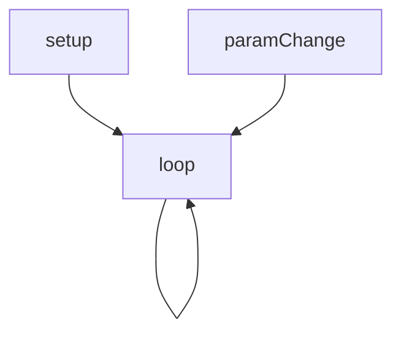
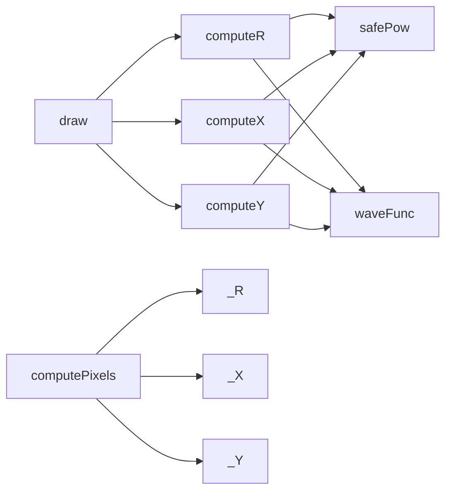
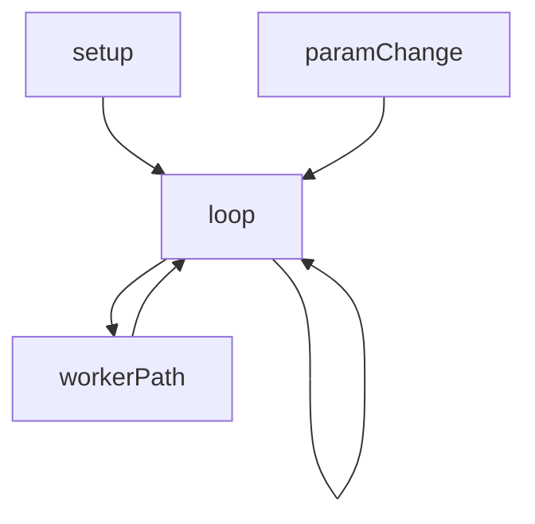
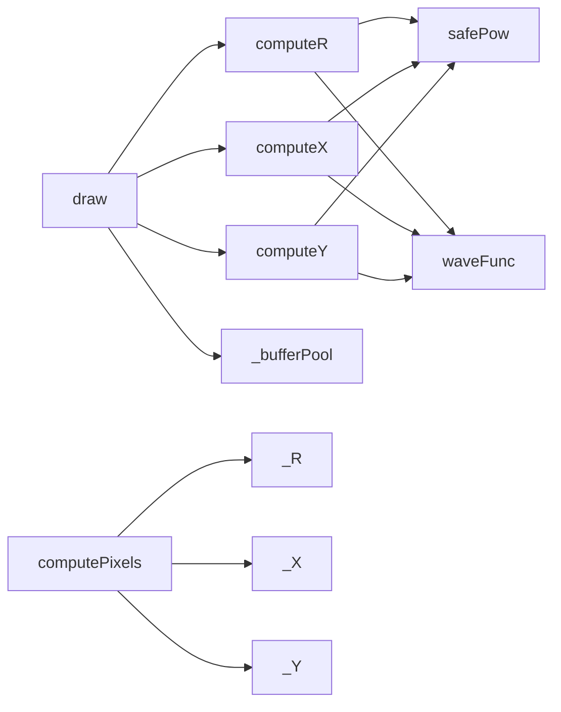

# wave-interference — System Map

## Reference (v4 — 2026-04-23)

**Source:** `reference/generators/wave-interference/source/wave-interference.gen.js` (440 lines)  
**Mode:** canvas2d  
**Coverage:** 9 functions mapped, 0 not-relevant

### Lifecycle

### Function Call Graph

### Data Pathways

| pathway_id | input | transform chain | output | per-frame? | parallelisable? |
|---|---|---|---|---|---|
| P-01 | params + pixel coords | normalise + rotate + R/X/Y evaluation | intensity field | yes | yes (per-pixel) |
| P-02 | intensity field | min/max normalise to greyscale | RGBA buffer | yes | yes (per-pixel) |
| P-03 | RGBA buffer | putImageData | canvas image | yes | partial (per-row) |

### State Inventory

| name | scope | type | purpose | initialised by | mutated by |
|---|---|---|---|---|---|
| TWO_PI | module-const | number | trig constant | top-level | (immutable) |
| LANDMARKS | module-const | Array<object> | preset catalogue | top-level | (immutable) |

## Live (v4 — 2026-04-23)

**Source:** `assets/js/tools/generators/scripts/wave/wave-interference.gen.js` (509 lines)  
**Mode:** canvas2d  
**Coverage:** 10 functions mapped, 0 not-relevant

### Lifecycle

### Function Call Graph

### Data Pathways

| pathway_id | input | transform chain | output | per-frame? | parallelisable? |
|---|---|---|---|---|---|
| P-01 | params + pixel coords | normalise + rotate + R/X/Y evaluation | intensity field | yes | yes (per-pixel) |
| P-02 | intensity field | min/max normalise to greyscale | RGBA buffer | yes | yes (per-pixel) |
| P-03 | cached buffers + RGBA buffer | pooled write + putImageData | canvas image | yes | partial (per-row) |
| P-04 | imageData + params + frame | computePixels worker function | worker-returned imageData | optional | yes (per-pixel) |

### State Inventory

| name | scope | type | purpose | initialised by | mutated by |
|---|---|---|---|---|---|
| TWO_PI | module-const | number | trig constant | top-level | (immutable) |
| _DEFAULTS | module-const | object | full preset defaults | top-level | (immutable) |
| LANDMARKS | module-const | Array<object> | full-map presets | top-level | (immutable) |
| _bufferPool | module | object map | per-canvas buffer reuse | top-level | draw |

## Architectural Divergence Notes

- Live migrates parameter keys from snake_case to camelCase across draw, worker, and UI metadata.
- Live adds pooled buffers (`_bufferPool`) to eliminate repeated per-frame large allocations.
- Live keeps worker offload path and sequencer metadata; export set diverges by omitting SVG.
