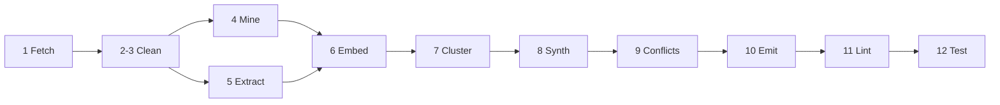

# Design-rule scrape pipeline (wiki)

Operational reference for the batch pipeline under `tools/scrape/`. Canonical product spec: [plan.md](../../ideas/create%20rules%20for%20ai/plan.md). Open questions: [audit.md](../../ideas/create%20rules%20for%20ai/audit.md). Tracker: [H4](../todo/H4-design-rule-pass-b.md), [H5](../todo/H5-design-rule-embed-cluster-synth.md), [H6](../todo/H6-design-rule-conflict-emit-lint.md).

## Goal

Build a versioned, agent-consumable corpus of design rules (graphic, print, UI/UX, infographics, movements, AI-era discourse) from public articles. Downstream: `.cursorrules` hot rules, per-category guides, optional linter.

## Defined terms

| Term | Meaning |
| --- | --- |
| Source | One URL in `sources.json` |
| Article | `clean.md` for that source |
| Assertion | Pass-A structural extract (`assertions.json`) |
| Claim | Pass-B LLM extract (`pass-b-claims.json`) |
| Cluster | HDBSCAN group of semantically similar claims |
| Draft rule | Merged claim set (`draft-rules.json`); not yet full `RuleSchema` with detectors |
| Tier-3 | Manual paste when fetch/clean cannot obtain body |

Cache key: `sha256(url)[:12]` (12 hex chars per directory name).

## Pipeline (13 stages)



| Stage | Script | Input | Output | Status |
| --- | --- | --- | --- | --- |
| 1 | `fetch.mjs` | `sources.json` | `cache/<hash>/raw.html`, `meta.json` | Shipped |
| 2–3 | `clean.mjs` | `raw.html` | `readable.html`, `clean.md` | Shipped |
| 4 | `mine.mjs` | `clean.md` | `assertions.json` | Shipped |
| 5 | `extract.mjs` | `clean.md` | `pass-b-claims.json` | Shipped |
| 6 | `embed.mjs` | `pass-b-claims.json` | `claims-embedded.json` | Shipped |
| 7 | `cluster.mjs` | all `claims-embedded.json` | `cache/_corpus/clusters.json` | Shipped |
| 8 | `synth.mjs` | `clusters.json` | `cache/_corpus/draft-rules.json` | Shipped |
| 9 | `conflict.mjs` | `draft-rules.json` | `conflict-free-rules.json`, `conflicts.queue.md` | Shipped |
| 10 | `categorise.mjs` | `conflict-free-rules.json` | `categorised-rules.json` | Shipped |
| 11 | `emit.mjs` | `categorised-rules.json` | `rules/**`, `INDEX.md`, guides, `hot-rules.md` | Shipped |
| 12 | `lint-compile.mjs` | emitted rules | `tools/lint/design-rules.mjs` | Shipped |
| 13 | `test-rules.mjs` | emitted rules | pass/fail exit code | Shipped |

Stages 1–3 are deterministic. Stage 5+ use LLM (Anthropic default; OpenAI optional). `scrape:run` = fetch + clean + mine only (no paid API by default).

## Source tiers

| Tier | Mechanism | Entry point | Success condition |
| --- | --- | --- | --- |
| 0 | Local .md file | `local-sources.json` → `ingest-local.mjs` | File exists and is readable |
| 1 | `fetch()` | `sources.json` → `fetch.mjs` | body ≥ 500 chars, no paywall sentinel |
| 2 | Puppeteer | `sources.json` → `fetch.mjs` | body ≥ 1000 chars, no sentinel |
| 3 | Manual paste | Queue file → `paste-loop.mjs` | User pastes body interactively |

Tier-0 hash: `sha256('local:' + relative_path)[:12]` — stable across machines, no collision with URL hashes. Tier-3 queue: `blog/ideas/create rules for ai/manual-paste.queue.md`. Process: `npm run scrape:paste`.

Default rate limit: 1 request/s (`--rate-ms=1000`). Timeouts: Tier-1 15s, Tier-2 30s.

## Pass-A strategies (`mine.mjs`)

1. List items under rule headings (`rules`, `principles`, `heuristics`, …).
2. Prescriptive blockquotes.
3. Code fences under rule headings.
4. Image alt text with do/don't language.
5. Heading-as-rule (H3+, imperative sentence > 30 chars).
6. Bold sentence at paragraph start (NN/g-style).

## Schema owners

| File | Owns |
| --- | --- |
| `taxonomy.mjs` | `CATEGORIES`, `MODALITY_VALUES`, `AUTHORITY_WEIGHTS` |
| `schema.mjs` | Zod: `RuleSchema`, `PassBClaimSchema`, `DraftRuleSchema`, `LocalSourceEntrySchema`, validators |
| `sources.json` | URL list + authority class + weight + `expected_tier` |
| `local-sources.json` | Local .md file list + authority class + weight + `category_hint` (Tier-0) |
| `paywall-sentinels.json` | Paywall substring stoplist |
| `manual-only.json` | Domains forced to Tier-3 (Medium, uxplanet.org, uxdesign.cc, …) |

Authority weights: established design-system 1.0; reputable publisher 0.7; domain expert 0.6; generic Medium 0.3; forum 0.2.

## npm commands

| Command | Runs |
| --- | --- |
| `npm run scrape:pipeline` | Stages 1–3 (`run-pipeline.mjs --stage=all`) |
| `npm run scrape:fetch` | Stage 1 |
| `npm run scrape:clean` | Stages 2–3 |
| `npm run scrape:paste` | Tier-3 interactive paste loop |
| `npm run scrape:mine` | Stage 4 |
| `npm run scrape:extract` | Stage 5 (API cost) |
| `npm run scrape:embed` | Stage 6 |
| `npm run scrape:cluster` | Stage 7 |
| `npm run scrape:synth` | Stage 8 |
| `npm run scrape:ingest-local` | Tier-0: ingest local .md files to cache |
| `npm run scrape:run` | fetch + clean + mine (no extract) |

Common flags: `--force`, `--limit=N`, `--url=<url>`, `--article=<hash>` (extract/mine), `--dry-run` (extract), `--provider=anthropic|openai`, `--model=<id>`.

## Environment variables

| Variable | Stage |
| --- | --- |
| `OPENAI_API_KEY` | 5 (optional provider), 6 (embeddings) |
| `ANTHROPIC_API_KEY` | 5 (default), 8 (multi-member clusters) |

## Cache layout (gitignored)

```
tools/scrape/cache/
  <hash>/
    raw.html
    meta.json          # tier, url, fetched_at, status_code, cleaned_at, clean_length
    readable.html
    clean.md
    assertions.json    # stage 4
    pass-b-claims.json # stage 5
    claims-embedded.json
  _corpus/
    clusters.json
    draft-rules.json
```

`tools/scrape/cache/` is in `.gitignore`. Re-runs are idempotent unless `--force`.

## Typical run order (stages 1–8)

```bash
# Tier-0: ingest local .md sources
npm run scrape:ingest-local

# Web sources (no LLM)
npm run scrape:pipeline
npm run scrape:mine

# Paid stages
export OPENAI_API_KEY=...
npm run scrape:extract
npm run scrape:embed
npm run scrape:cluster
export ANTHROPIC_API_KEY=...   # only if multi-member clusters need merge
npm run scrape:synth -- --force
```

## Stages 9–13 detail

### Stage 9 — Conflict-detect (`conflict.mjs`)

Two rules conflict iff: (a) semantic similarity > 0.75 cosine (embedding) or 0.35 Jaccard (fallback), AND (b) modalities are opposing (`MUST`↔`MUST_NOT`, `SHOULD`↔`SHOULD_NOT`), AND (c) `scope` arrays overlap. Movement-partitioned rules (non-empty, disjoint `movements`) are logged but not removed. Conflicting rules are parked until `conflicts.queue.md` entries are manually resolved.

### Stage 10 — Categorise (`categorise.mjs`)

Builds per-category centroids from `claims-embedded.json` vectors. Embeds each draft rule statement and finds nearest centroid. Reassigns category when nearest cosine > 0.7 and synth-assigned cosine < 0.5. Otherwise sets `category_review: true`. Requires `OPENAI_API_KEY`; passes through synth categories if absent.

### Stage 11 — Emit (`emit.mjs`)

Promotes draft rules to full `RuleSchema` (fills `confidence`, `priority`, `consensus`; defaults `decidable: 'judgment'`, `detector: { kind: 'none' }`). Writes:
- `blog/docs/standards/rules/<category>/<id>.md` — per-rule file with YAML front-matter
- `blog/docs/standards/rules/INDEX.md` — compact index (≤ 2000 tokens, char estimate)
- `blog/docs/standards/<category>.md` — per-category narrative guide
- `blog/docs/standards/hot-rules.md` — top MUST/MUST_NOT by `priority × confidence` (≤ 6000 tokens)
- `blog/docs/standards/routing-map-rows.md` — pre-decision read map rows for agent routing
- `cache/_corpus/emitted-rules.json` — machine-readable corpus for stages 12–13

### Stage 12 — Lint compile (`lint-compile.mjs`)

Scans `emitted-rules.json` for decidable rules (`decidable ∈ {'full', 'partial'}`, `detector.kind ≠ 'none'`). Compiles each `regex`/`css-prop` detector into a check function and emits `tools/lint/design-rules.mjs`. AST detectors are skipped (not yet implemented). Run via `npm run lint:design`. Misfire log: `tools/lint/lint-misfires.md`.

### Stage 13 — Test (`test-rules.mjs`)

For every compilable decidable rule: asserts `examples.bad` strings trip the detector and `examples.good` strings do not. Exit 1 if any assertion fails (CI-blocking). Run via `npm run test:design-rules`. Currently a no-op (all stage-11 output is judgment) — becomes active when detectors are hand-authored.

## Audit resolutions (stages 9–13)

| ID | Resolution |
| --- | --- |
| Q-005 | CI only — no pre-commit hook |
| Q-006 | BDFL queue file (`conflicts.queue.md`) |
| Q-015 | Character estimate: 1 token ≈ 4 chars (cl100k_base approximation) |
| Q-016 | `<!-- HOT-RULES:START -->` / `<!-- HOT-RULES:END -->` delimiters |
| Q-017 | `examples.bad` ≥ 1 enforced for `decidable ≠ 'judgment'` in `validateRule()` |

## Extended cache layout (stages 9–13)

```
tools/scrape/cache/_corpus/
  clusters.json           # stage 7
  draft-rules.json        # stage 8
  conflict-free-rules.json  # stage 9
  categorised-rules.json    # stage 10
  emitted-rules.json        # stage 11 (machine corpus)
blog/docs/standards/
  conflicts.queue.md        # stage 9 (git-tracked, human-resolved)
  rules/
    INDEX.md                # stage 11
    <category>/<id>.md      # stage 11
  <category>.md             # stage 11 (per-category guides)
  hot-rules.md              # stage 11
  routing-map-rows.md       # stage 11
tools/lint/
  design-rules.mjs          # stage 12 (generated)
  lint-misfires.md          # stage 12 (append-only triage log)
```

## Extended run order (full pipeline)

```bash
# Stages 1–8 (see above)
npm run scrape:pipeline && npm run scrape:mine

# Paid stages
export OPENAI_API_KEY=...
npm run scrape:extract && npm run scrape:embed && npm run scrape:cluster
export ANTHROPIC_API_KEY=...
npm run scrape:synth -- --force

# Stages 9–13
npm run scrape:conflict
npm run scrape:categorise   # requires OPENAI_API_KEY for centroid embedding
npm run scrape:emit
npm run scrape:lint-compile
npm run test:design-rules    # CI-blocking
npm run lint:design          # CI-blocking
```

## Related paths

| Path | Role |
| --- | --- |
| `blog/ideas/create rules for ai/plan.md` | Full pipeline + schema spec |
| `blog/ideas/create rules for ai/audit.md` | Blocking questions and holes |
| `blog/ideas/create rules for ai/sites to scrape for design rules.md` | Original URL feeder (superseded by `sources.json`) |
| `tools/scrape/prompts/pass-b.md` | Pass-B prompt (versioned) |
| `tools/scrape/prompts/synth.md` | Cluster synthesis prompt |
| `blog/docs/standards/conflicts.queue.md` | Conflict pairs awaiting resolution |
| `blog/docs/standards/rules/INDEX.md` | Compact rule index (≤ 2000 tokens) |
| `blog/docs/standards/hot-rules.md` | Top MUST/MUST_NOT block for .cursorrules |
| `tools/lint/design-rules.mjs` | Compiled linter (generated, do not edit) |
| `tools/lint/lint-misfires.md` | Append-only detector misfire log |
