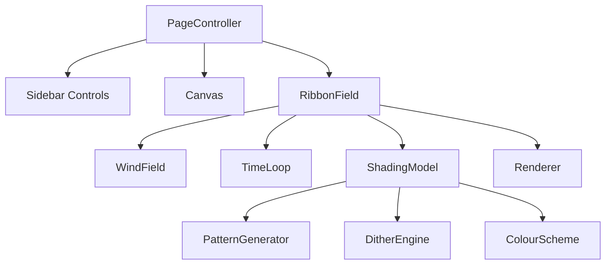
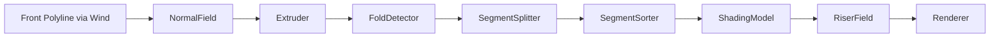

# Ribbon Breeze Weave — Page Design Document (Canvas)

## 1. Goals
- Build a procedural ribbon field driven by a shared wind field.
- Maintain a 2.5D illusion with extrusion, shading modes, segmentation, and risers.
- Support multiple shading styles: gradient, inverted gradient, flat, pattern, dither.
- Provide colour controls for front, underside, risers, lines, and patterns.
- Enable per-ribbon variation and time‑based modulation.
- Support perfect looping for any user‑specified number of frames.
- Maintain strict OOP architecture compatible with existing SiteBoy components.
- Follow F‑system layout, page-design-guide, and shared-utilities patterns.

## 2. Glossary
- **Ribbon**: A sinusoidal polyline representing one row.
- **Segment**: A monotonic curvature slice of a ribbon.
- **WindField**: Loop-safe travelling waveform.
- **Extrusion**: Offset front polyline along normals.
- **Riser**: Vertical line from fold points.
- **ShadingMode**: Gradient, inverted, flat, pattern, dither.
- **Perfect Loop**: Animation repeats identically after N frames.
- **F-system**: Proportional layout system using F-units.

## 3. High-Level Architecture
- Sidebar panel (F‑system aligned)
- Canvas (actual/fit mode)
- Page Controller wiring all components

## 4. System OOP Architecture
- **Core Classes**: RibbonField, Ribbon, RibbonSegment, WindField, Extruder, FoldDetector, NormalField, SegmentSorter, RiserField, ShadingModel, PatternGenerator, DitherEngine, ColourScheme, TimeLoop, Renderer.
- **Shared Utilities**: vector ops, interpolation, noise, RNG, bounds, polyline tools.

## 5. Class Specifications
### RibbonField
- Owns all ribbons; orchestrates per-frame update.
- Inputs: global params, WindField, Extruder, ShadingModel, TimeLoop.
- Outputs: processed segments + rendering queue.

### WindField
- Loop-safe travelling wave.
- omega = 2πM / loopFrames.

### Ribbon
- Holds geometry and shading data for one ribbon.
- Produces segments and risers.

### RibbonSegment
- Holds front/back slices + shading metadata.
- Computes depth key.

### NormalField
- Computes tangents + normals.

### Extruder
- Offsets front polyline → back polyline.

### FoldDetector
- Detects curvature sign changes.

### SegmentSorter
- Orders segments by screen-space depth.

### RiserField
- Generates risers from fold boundaries.

### ShadingModel
- Strategy-based shading: gradient, inverted, flat, pattern, dither.
- Supports time variation and per-ribbon variation.

### PatternGenerator
- Procedural stripes, hatch, checker, noise; loop-safe.

### DitherEngine
- Ordered/blue-noise dithering of shapes.

### ColourScheme
- Stores colours for all components.

### TimeLoop
- Provides loop-safe LFOs, phases, noise time.

### Renderer
- Draws shaded segments, risers, contours, diagnostics.

## 6. Mermaid — System Architecture

## 7. Ribbon Pipeline

## 8. Dataflow
1. Frame begins → TimeLoop computes phases.
2. RibbonField samples WindField → front polylines.
3. Normals computed.
4. Extrusion.
5. Fold detection.
6. Segments built.
7. Segments sorted.
8. Shading applied (strategy selected).
9. Risers generated.
10. Renderer draws back → front.

## 9. Parameter Schema
### Layout
- rows, rowSpacing, ribbonLength, pointsPerRibbon
- rotation, verticalCompression, perspectiveDepthScale
- horizontalOffset, thickness, thicknessDepthFactor

### Wind
- k, omega, phaseShear
- baseAmplitude, amplitudeJitterRange, phaseJitterRange
- profileShort, profileLong, profileExponent
- noiseAmount, noiseScale

### Shading
- shadingMode
- invertGradient
- patternType, patternScale, patternAngle
- ditherType, ditherPalette
- frontShadeTop, frontShadeBottom, shadeExponent
- undersideDarkAlpha, undersideLightAlpha, normalInfluence
- contrastBoost

### ColourScheme
- frontColor, undersideColor, riserColor, lineColor
- patternFg, patternBg

### Variation
- shadingModeVariation
- colourVariationPerRibbon
- timeVariationStrength
- patternPhaseShift
- ditherTemporalShift

### Loop
- loopFrames
- windCycles
- lfoCycles
- patternCycles
- colourCycles

### Diagnostics
- showNormals
- showFoldMarkers
- showBounds

## 10. Rendering Logic
### Per Segment
- Determine shading strategy.
- Gradient / inverted gradient via normal direction.
- Flat fill via ColourScheme.
- Pattern fill via PatternGenerator.
- Dither fill via DitherEngine.
- Draw underside, risers, contour.

### Per Ribbon
- Depth-sorted segment rendering.

### Global
- Rows drawn back → front.

## 11. Sidebar UI
- CONTROLS: layout + wind
- SHADING: shading mode, parameters
- COLOUR: colour scheme
- LOOP: perfect loop configuration
- DIAGNOSTICS: overlays, helpers

## 12. Notes
- Fully compatible with SiteBoy’s modular component model.
- All animations loop cleanly via TimeLoop.
- Segmentation prevents self-overlap shading artefacts.
- ShadingModel keeps Renderer minimal.

